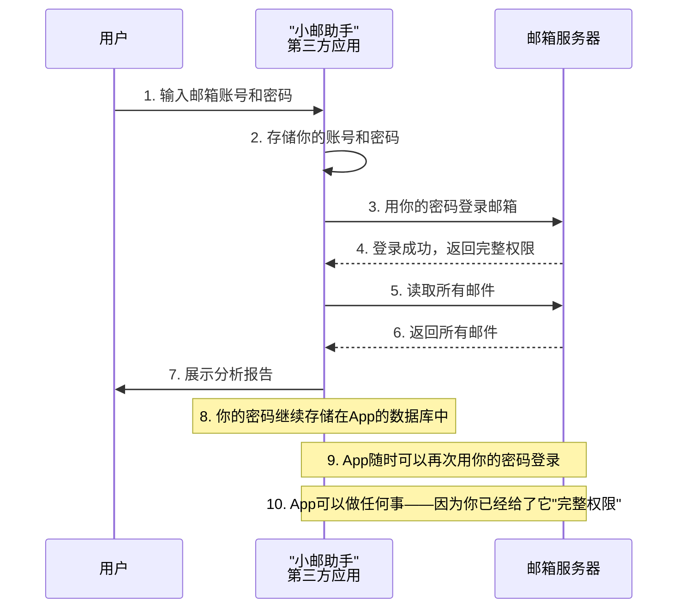

## 要点1：先把代码放一边，只讲协议本身

很多同学一听到 OAuth2 就头疼，既怕概念枯燥，又怕代码复杂。开篇我必须先给大家吃一颗定心丸：**这是一门关于 OAuth2 协议的通用课程。**不写一行 Java 代码，也不写一行 Python 代码。

为什么？因为我发现最大的学习误区，就是一上来就陷入某个框架的配置细节里，把"协议逻辑"和"语言实现"混为一谈。

这个阶段我们只做一件事：**用 Postman 把 OAuth2 的每一次"握手"拆解清楚。** 流程跑通了，token 怎么来、怎么用都搞明白了，后续无论你用 Spring Boot、Django 还是 Go，都只是"翻译"工作而已。

## 要点2：抓"裸协议"，理解本质

很多项目引入第三方开发包后，OAuth2 登录几行配置就搞定了。但一旦报错——比如 `invalid_grant` 或 `redirect_uri_mismatch`——很多同学就懵了，因为框架把底层的 HTTP 交互全封装了。

所以这门课最核心的方式就是**回归 HTTP 本身**。全程用 Postman 手动构造请求，一步步走完授权流程、获取 Token、携带 Token 访问资源。

当你亲眼在 Postman 的响应体里看到 Access Token 和 Refresh Token 的返回，你就真正掌握了 OAuth2 的"命脉"。这就像学计算机网络，不能只调 Socket API，一定要先学会用 Wireshark 看 TCP 握手一样。

## 要点3：分两层走——先通协议，再落代码

这套课程采用"分层递进"的结构：

- **第一层（当前阶段）**：专注 **"协议语"** 。用 Postman 扮演客户端和服务器，把 OAuth2 的四种授权模式（尤其是授权码模式）讲透。不掺杂语言特性，确保大家在统一标准下沟通。
- **第二层（后续模块）**：**实战落地**。用 Python（FastAPI）和 Java（Spring Boot）分别将 Postman 中验证过的逻辑实现为真实后端代码。

现在的 Postman 实验，就是为后续手写认证服务器打地基。地基不牢，写再多代码也是空中楼阁。

## 要点4：掌握协议视角，一通百通

如果你身处微服务或多语言协作环境——前端 Node.js，后端 A 用 Java，后端 B 用 Python，网关用 Go——只懂"Java 里的 OAuth2"是远远不够的。

但当你以**协议视角**来看待问题时，面对任何语言、任何框架，你只需要问自己三个问题：**Token 放在哪个 Header 里？参数叫什么名字？过期了怎么刷新？** 这三个问题搞懂了，具体实现只是查 API 文档的事。

这就是通用课程的核心价值——**触类旁通**，而不是被某一套 SDK 绑定。

## 要点5：Postman 实验的设计思路

课程配套的 Postman 实验，核心目标是把 OAuth2 的协议交互完全**"可视化"**。我会把完整的授权流程拆解成独立的 HTTP 请求，在 Postman 中逐个发起、逐个观察。每个请求对应协议中的一个步骤——从申请授权、获取 Code，到换取 Token，再到携带 Token 访问资源——环环相扣，每一步的输入输出都清晰可见。

整个实验只依赖 Postman 和一个测试服务器地址，不涉及任何编程语言和运行环境。你可以把全部精力放在理解协议本身，而不是被配置、依赖、版本等问题干扰。

学完这套实验，你对 OAuth2 的理解是"协议级别"的。后续无论在哪种语言或框架下实现，你都能清楚地知道每一步在做什么。

# OAuth2是什么：问题与需求

## 课程目标

- 从生活场景出发，理解"密码共享"方案的本质缺陷
- 掌握互联网世界中第三方应用访问用户数据的安全困境
- 理解 OAuth2 协议诞生的背景和要解决的核心问题
- 建立"令牌（Token）"替代"密码（Password）"的初步概念

## 从一个生活场景说起

### 你遇到过这种情况吗？

想象一下这样一个场景：

你住在一个高档小区，家里请了一位钟点工阿姨，每周来打扫一次卫生。但是小区门禁很严，没有门禁卡进不来。怎么办呢？

**方案一**：把你的门禁卡复制一张给阿姨。

这看起来解决了问题，但细想一下问题很大：

- 阿姨拿着你的门禁卡，不仅能在你来的时候来，还能半夜来
- 阿姨拿着你的门禁卡，不仅能进单元门，还能进你家的楼栋、地下车库、健身房——因为她手里的卡和你的一模一样
- 你想让阿姨只能每周三下午来，但门禁系统不支持"按时间段授权"
- 某天阿姨不干了，你忘了收回门禁卡——或者她偷偷复制了一张

**方案二**：每次阿姨来的时候，你亲自下楼去接。

这倒是安全，但你很快就崩溃了——每周三下午你都有会，根本走不开。

**方案三**：给阿姨办一张"访客专用卡"。

这张卡的特点是：

- 只能刷单元门，刷不开你家房门
- 只能每周三下午 2:00-5:00 使用
- 有效期只有一个月，到期自动失效
- 你可以随时在管理处挂失这张卡
- 管理处可以查到阿姨每次刷卡进出的记录

> [!TIP]
> **这就是 OAuth2 在现实世界中的翻版。** 门禁卡就是"密码"方案，访客专用卡就是"令牌（Token）"方案。OAuth2 要做的，就是设计一套互联网世界的"访客专用卡"系统。

你可能会说："这有什么难的？不就是发一张权限受限的卡吗？"

问题在于，互联网世界比现实世界复杂得多——有无数种不同类型的"门"（API 接口），有无数个不同的"访客"（第三方应用），而且"门"和"访客"可能属于完全不同的公司，它们之间要通过互联网通信，没有任何"管理处"的统一协调。OAuth2 就是这套复杂生态下的"访客卡标准协议"。

### 把生活场景翻译成技术场景

现在我们把上面的故事翻译成技术术语：

| 生活场景                     | 技术场景                                                                     |
| ---------------------------- | ---------------------------------------------------------------------------- |
| 你                           | 用户（User）/ 资源拥有者（Resource Owner）                                   |
| 你的房子和里面的东西         | 受保护资源（Protected Resources）——比如你在微信上的头像、昵称、好友列表      |
| 钟点工阿姨                   | 第三方应用（Client/Third-Party App）——比如一个"帮你生成年度报告"的微信小程序 |
| 小区门禁管理处               | 授权服务器（Authorization Server）——专门负责发卡（令牌）的机构               |
| 你家的门、单元门、车库门     | 资源服务器（Resource Server）——不同的 API 接口                               |
| 访客专用卡                   | 访问令牌（Access Token）                                                     |
| 卡的有效期只有一个月         | 令牌有时效性（Expiration）                                                   |
| 只能开单元门，不能开你家房门 | 令牌有权限范围（Scope）                                                      |
| 随时可以去管理处挂失         | 令牌可撤销（Revocation）                                                     |
| 管理处有刷卡记录             | 令牌可审计（Auditability）                                                   |

### 深入探讨：为什么这个类比如此贴切？

让我们把"访客卡"方案和"复制门禁卡"方案做一个更细致的对比，你会发现问题远比你想象的严重：

| 对比维度     | 复制门禁卡（密码方案）     | 访客专用卡（令牌方案）            |
| ------------ | -------------------------- | --------------------------------- |
| **安全性**   | 阿姨获得和你完全相同的权限 | 阿姨只获得完成任务所需的最小权限  |
| **时效控制** | 无法控制——卡永久有效       | 可以设置精确的过期时间            |
| **访问范围** | 全小区通用                 | 仅限特定区域                      |
| **撤销方式** | 只能换掉全部门禁系统       | 管理处单独注销这张卡即可          |
| **使用记录** | 无法区分是谁在刷卡         | 每张卡有独立 ID，可精确追踪       |
| **滥用风险** | 阿姨可以在任何时间做任何事 | 阿姨只能在授权范围内做事          |
| **泄露后果** | 卡被复制 = 你的身份被冒用  | 卡被复制 = 攻击者只能访问受限区域 |

> [!NOTE]
> 这个类比中有一个非常关键的点：**密码方案中，你把"身份"交给了别人；而令牌方案中，你只把"权限"交给了别人。** 前者意味着别人可以完全冒充你，后者意味着别人只能在你的许可下做特定的事。这个区别是理解 OAuth2 安全模型的基石。

## 互联网世界面临的同样困境

### 一个真实的互联网应用场景

现在让我们把视线从生活场景转移到互联网世界。

假设你开发了一个叫"小邮助手"的应用，它的功能是：帮你分析你的电子邮箱，统计你每个月收到多少封营销邮件，并自动帮你退订那些你从来不打开的邮件订阅。

这个功能听起来很实用，但"小邮助手"要分析你的邮件，首先得能看到你的邮件。那它怎么才能看到你的邮件呢？

**最直接的办法**：你告诉"小邮助手"你的邮箱账号和密码。

就像你把家里的门禁卡直接复制给钟点工一样，"小邮助手"拿着你的账号密码，就能：

- 登录你的邮箱
- 读取你所有的邮件（包括那些极其私密的邮件）
- 标记邮件为"已读"或"未读"
- 删除邮件
- 修改邮箱设置
- 修改密码
- 理论上，它可以用你的身份做任何事

**这合理吗？显然不合理。** 但你可能会说："那又怎样？我信任这个应用啊！"

问题是，信任不解决技术上的安全问题。我们来看几个真实发生过的案例：

> [!CAUTION]
> **2018 年，Facebook 发生了轰动全球的数据泄露事件。** 第三方应用"Cambridge Analytica"通过 Facebook 的 OAuth 授权机制，获取了超过 5000 万用户的个人信息。这个事件影响如此之大，以至于 Facebook 的 CEO 扎克伯格被美国国会传唤作证。Facebook 股价因此暴跌，市值蒸发数百亿美元。

> [!WARNING]
> **密码共享还有一个被忽视的致命问题：** 2019 年，某第三方数据分析应用因数据库配置错误（一台 Elasticsearch 服务器未设置密码），导致 2 亿多条用户数据在网上公开暴露。其中就包括了大量用户的明文密码——因为这些应用在存储用户密码时压根没有做加密。讽刺的是，即使你百分百信任这个应用，你也无法保证它的技术团队不会犯这种低级错误。

### "密码共享"方案的深入剖析

让我们把一个完整的故事展开，看看"密码共享"模式下，到底发生了什么：

这个流程表面上"行得通"，但每一个环节都隐藏着巨大的安全隐患：

**第 1 步的问题**：用户在输入密码时，无法知道这个密码是否会被妥善处理。浏览器地址栏显示的是"小邮助手"的网址，而不是邮箱的网址——也就是说，你在把密码交给一个"陌生人"。

**第 2 步的问题**："小邮助手"的数据库是否安全？它的开发人员是否有权限查看数据库中的明文密码？它的运维人员是否会在日志中不小心记录下请求体中的密码？很多公司甚至连基本的密码哈希都没有做。

**第 3 步的问题**："小邮助手"用你的密码登录邮箱时，邮箱服务器看到的请求来源是"小邮助手"的服务器 IP，但携带的是"用户"的密码。邮箱服务器无法区分"这是用户本人在登录"还是"第三方应用在用用户的密码登录"。

**第 4-6 步的问题**：邮箱服务器返回了"完整权限"——因为密码本身就代表完整权限。邮箱服务器没有能力说"我只给你读邮件的权限，不给你删邮件的权限"，因为密码模式下根本不存在"部分权限"的概念。

**第 8 步的问题**："小邮助手"存储了你的密码，这意味着它随时可以再次登录你的邮箱——即使你半年没有使用这个应用了。更可怕的是，如果"小邮助手"内部某个员工滥用权限，可以用你的密码登录你的邮箱，而你对此一无所知。

**第 10 步的问题**："小邮助手"不仅获得了你"当前"邮箱的全部权限，如果你在邮箱中关联了其他服务（比如用邮箱注册了其他平台），攻击者还可以通过"忘记密码"功能，用这个邮箱接收重置链接，进而入侵你的其他账号。

### 传统"密码共享"方案的四大致命问题

让我们把这四个问题一个一个拆开来看：

| 问题                 | 详细说明                                                                                                                                                                                                      | 现实后果                                                                                          |
| -------------------- | ------------------------------------------------------------------------------------------------------------------------------------------------------------------------------------------------------------- | ------------------------------------------------------------------------------------------------- |
| **一、密码泄露风险** | 第三方应用需要存储你的密码。如果它的数据库被攻破（如 SQL 注入），或开发人员作恶，或日志中记录了密码，你的密码就会暴露。更糟糕的是，绝大多数人在多个平台使用相同密码，一个平台密码泄露，等于所有平台密码泄露。 | 黑客可以用你的密码登录你的邮箱、社交账号、甚至网银。                                              |
| **二、权限过大**     | 第三方应用获得了你账户的"完整权限"——它能做的事和你本人一样多。但"小邮助手"只需要"读取邮件"，根本不需要"删除邮件"或"修改密码"。这就是所谓的最小权限原则（Principle of Least Privilege）被彻底违反。            | 即使是善意的应用，也可能因为程序 bug 误删你的重要邮件。如果是恶意的应用，它可以清空你的整个邮箱。 |
| **三、无法精细撤销** | 用户想收回权限时只能修改密码，但改密码会影响所有使用该密码的应用。比如你想停止使用"小邮助手"，但改了密码后，你的手机邮箱客户端、电脑邮件软件也都需要重新登录——它们用的是同一个密码。                          | 用户被迫在"继续让不信任的应用访问"和"忍受所有设备重新登录"之间做选择。                            |
| **四、无法审计追溯** | 服务器收到的所有请求都带着"用户本人"的身份标识（即密码登录后建立的会话或 Cookie）。服务器无法区分"这个请求是用户本人发出的"还是"第三方应用代表用户发出的"。                                                   | 如果发生了异常操作（如大量邮件被删除），无法追溯到底是用户干的还是第三方应用干的。                |

**这四个问题的本质是什么？**

> [!IMPORTANT]
> **上述所有问题的根源只有一个：密码 = 身份。** 当你把密码交给第三方应用，你就相当于把你的"数字身份"完整地交给了它。一个完整的数字身份包含了你的所有权限、所有个人数据、以及所有基于此身份建立的其他信任关系。这就像你把身份证原件交给一个陌生人去办事——理论上他可以代表你做任何事情。

### 更糟的情况：你不是在授权一个应用，而是在授权一群应用

我们再来深入想一层：如果你使用的是第三方应用平台（比如微信小程序），情况就更复杂了。

你在微信小程序里授权"小邮助手"的时候，它可能不仅仅是一个应用，而是一个由多个微服务组成的系统：

- "小邮助手"的主程序需要读邮件
- "小邮助手"的 AI 分析模块需要读邮件
- "小邮助手"的推荐系统需要读邮件
- "小邮助手"的客服系统需要读邮件

如果所有这些模块都使用同一个账号密码，那就意味着：**任何一个模块被攻击，你的整个邮件账户就完蛋了。**

而用令牌方案（OAuth2），你可以：

- 为不同模块颁发不同的令牌
- 每个令牌设置不同的权限范围（AI 模块只能读邮件，不能删邮件）
- 每个令牌设置不同的有效期
- 单独撤销任意一个令牌，不影响其他模块

> [!NOTE]
> **这就是 OAuth2 的核心理念：用令牌（Token）代替密码（Password），并且令牌是可以精细控制的。** 你可以为不同场景颁发不同权限范围、不同有效期的令牌，而且可以随时撤销某个令牌而不影响其他令牌。

## 我们在"密码共享"和"授权委托"之间寻找平衡

### 到底有没有一种更好的方式？

让我们停下来思考一个问题："小邮助手"这样的应用想要访问用户的邮件，这个需求本身是合理的。我们不能因为"密码共享"不安全就禁止所有第三方应用访问用户数据——那样的话，整个互联网生态的创新都会停滞。

所以我们要的其实是一种**平衡**：

| 需求       | 说明                                         |
| ---------- | -------------------------------------------- |
| **安全**   | 用户密码不能暴露给第三方应用                 |
| **有限**   | 第三方应用只能获得完成任务所需的最小权限     |
| **可控**   | 用户可以随时撤销授权                         |
| **可追溯** | 所有操作可以追溯到具体的应用                 |
| **易用**   | 用户体验不能太差（不能让用户每次都要输密码） |

> [!TIP]
> **这就是 OAuth2 要解决的问题集合。** 它不是一个"要不要授权"的问题，而是"如何以一种安全、可控、可追溯的方式实现授权"的问题。

### 如果不用 OAuth2，还有别的办法吗？

可能会有同学问：既然密码共享有这么多问题，那我们设计一个"两阶段验证"方案不行吗？比如用户先登录邮箱服务器，获取一个"临时凭证"，然后把这个临时凭证交给"小邮助手"——这不就解决了吗？

这个思路是对的，但实际实现中有很多细节问题：

| 问题                         | 说明                                                           |
| ---------------------------- | -------------------------------------------------------------- |
| **谁来发这个临时凭证？**     | 邮箱服务器需要有一个专门的"发凭证"接口                         |
| **凭证的格式是什么？**       | 不能是密码，那应该是什么格式的字符串？                         |
| **凭证包含哪些信息？**       | 它应该携带用户 ID、有效期、权限范围等信息                      |
| **小邮助手怎么用这个凭证？** | 它在请求 API 时如何传递这个凭证？是在 Header 里还是在 URL 里？ |
| **邮箱服务器怎么验证凭证？** | 验证凭证的机制是什么？要查数据库吗？要解密吗？                 |
| **凭证过期了怎么办？**       | 应用需要重新申请凭证吗？用户要重新登录吗？                     |

如果每个服务商都自己设计一套"临时凭证"方案，那结果就是：

- 微信有一套方案，凭证放在 URL 参数里，叫 `wx_token`
- Google 有一套方案，凭证放在 HTTP Header 里，叫 `Authorization: GoogleLogin auth=...`
- GitHub 有一套方案，凭证是 Base64 编码的字符串，放在 `Authorization` 里，但格式是 `token xyz`
- 百度有一套方案，凭证要放在 Cookie 里，叫 `baidu_auth`

**作为开发者，你的应用想要同时支持微信登录、Google 登录、GitHub 登录、百度登录——你就得为每一个服务商单独写一套代码。** 每个服务商的 API 调用方式不同、凭证格式不同、错误处理方式不同——这简直是一场噩梦。

> [!IMPORTANT]
> **OAuth2 的价值就在这里：它提供了一个"统一的标准"。** 它规定了授权流程的每一个步骤、每一个 HTTP 请求的格式、每一个参数的名称、每一种错误情况的处理方式。任何服务商只要按照 OAuth2 标准来实现，任何开发者只要按照 OAuth2 标准来调用，双方就能无缝对接。这就是"标准协议"的力量。

## OAuth2 之前的世界是什么样的？（历史背景）

### 互联网早期的"混乱时代"

在 OAuth2 出现之前（OAuth 1.0 于 2007 年发布，OAuth2 于 2012 年发布），互联网上第三方应用访问用户数据的方式可以用"混乱"来形容。

**2004-2007 年间典型的第三方集成方式**：

| 服务商                    | 第三方集成方式                                                      | 安全级别        |
| ------------------------- | ------------------------------------------------------------------- | --------------- |
| 早期 Google API           | 需要用户提供 Google 账号密码                                        | 🔴 极度危险     |
| Flickr API                | 使用"共享密钥"（shared secret）方式，开发者把用户的密钥嵌入到应用中 | 🟡 比较危险     |
| Yahoo! 早期 API           | 自定义的 OAuth 前身方案（BBAuth）                                   | 🟡 比较危险     |
| Twitter 早期 API（2006）  | 基本认证（HTTP Basic Auth），也就是明文传输用户名密码               | 🔴 极度危险     |
| 各网站私有的 API Key 方案 | 每个网站一套独立的 API Key 体系，互不兼容                           | 🟠 混乱且不安全 |

### OAuth 1.0 的诞生

2007 年，OAuth 1.0 作为第一个标准化的授权协议诞生了。它在设计上非常注重安全性，但使用了复杂的加密签名机制，实现起来相当困难——开发者需要将请求参数按照特定规则排序、拼接、然后用 HMAC-SHA1 签名，任何一个步骤出错都会导致请求失败。

2008 年，OAuth 1.0 被正式发布为 RFC 5849（Request for Comments，互联网标准草案）。但由于它的复杂性，很多开发者望而却步。

### OAuth2 的诞生与"妥协"

2012 年，OAuth2 正式发布为 RFC 6749。相比 OAuth 1.0，OAuth2 做出了一个重要的改变：

**OAuth1 强调"签名"——所有请求都要加密签名，安全性极高但实现复杂。OAuth2 强调"HTTPS"——要求所有通信必须使用 HTTPS，大幅简化了实现难度，同时依靠传输层加密来保障安全。** 这个权衡使得 OAuth2 的采用率大幅提升，但代价是 OAuth2 不再提供端到端的加密保护——它把安全责任转移到了传输层（HTTPS）。

OAuth2 的设计目标非常明确：

1. **简单（Simple）**：让开发者容易实现客户端和服务器
2. **安全（Secure）**：在不暴露用户密码的前提下实现授权
3. **灵活（Flexible）**：支持多种不同类型的应用（Web、移动、桌面、机顶盒等）
4. **可扩展（Extensible）**：允许在不改变核心协议的情况下增加新的授权模式

## 本讲小结

本节课我们学习了：

1. **生活场景类比**：
   - 密码方案 = 复制门禁卡给钟点工——你有几把卡，她就有几把
   - 令牌方案 = 给钟点工发访客专用卡——权限、时间、区域都可控
2. **互联网的困境**：
   - 第三方应用想访问用户数据，但密码共享存在四大致命问题
   - 密码泄露、权限过大、无法撤销、无法追溯
3. **问题的本质**：
   - 密码 = 完整身份，密码共享 = 交出数字身份
   - OAuth2 的核心理念：用令牌代替密码
4. **OAuth2 的历史背景**：
   - OAuth1 签名复杂 → OAuth2 简化设计 + 强制 HTTPS
   - 从 2007 年到今天，OAuth2 已成为事实上的互联网授权标准
