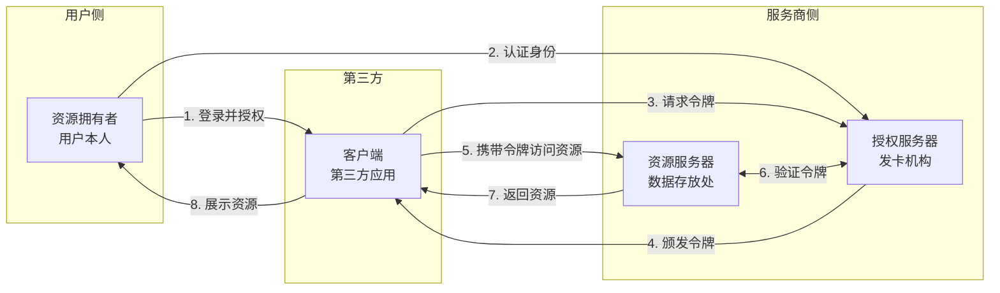

## 课程目标

- 正式掌握 OAuth2 的准确定义
- 深入理解四个关键角色及其职责
- 彻底区分"认证"和"授权"这两个核心概念
- 了解四种授权模式的适用场景
- 用 Postman 完成 OAuth2 授权流程的首次体验

## OAuth2 的正式定义

### 一句话定义

**OAuth2（Open Authorization 2.0）** 是一个**开放授权协议**，它允许用户授权第三方应用**有限地**访问其在某个服务商上存储的受保护资源，**而无需将用户名和密码交给第三方应用**。

我们来拆解这句话中的关键要素：

- **开放协议**：任何人都可以免费使用、实现和扩展，不受专利限制
- **授权**：OAuth2 处理的是"授权"问题，而非"认证"问题
- **有限地**：最小权限原则——只授予完成任务所需的最小访问权限
- **受保护资源**：用户存储在服务商处的私人数据
- **无需交出密码**：这是 OAuth2 最核心的安全承诺

### 核心思想：用"令牌"代替"密码"

让我们把密码和令牌做一个全方位对比：

| 对比维度     | 密码（Password）                       | 令牌（Token）                                  |
| ------------ | -------------------------------------- | ---------------------------------------------- |
| **是什么**   | 用户的身份凭证，是静态的、长期不变的   | 一个动态生成的字符串，是临时的"钥匙"           |
| **时效性**   | 长期有效，直到用户主动修改             | 短期有效（通常几分钟到几小时），可设置过期时间 |
| **权限范围** | 用户拥有的全部权限                     | 只授予应用需要的特定权限（最小权限原则）       |
| **可撤销性** | 几乎无法单独撤销——改密码会影响所有应用 | 可以单独撤销任意一个令牌，不影响其他令牌       |
| **泄露后果** | 灾难性的——攻击者获得账户完整控制权     | 可控的——攻击者只能获得有限权限，且令牌很快过期 |
| **使用方式** | 验证用户的"身份"——证明"我是谁"         | 验证"授权"——证明"我有权限访问这个资源"         |
| **可审计性** | 无法区分是用户本人还是第三方应用       | 每个令牌有唯一标识，可以精确追踪是谁在访问     |

### 一个更深入的类比：酒店房卡系统

想象你入住了一家大型豪华酒店，酒店为你定制了这样一套房卡系统：

**这张房卡有以下特性**：

| 房卡特性                         | 对应的 OAuth2 概念           | 技术含义                     |
| -------------------------------- | ---------------------------- | ---------------------------- |
| 房卡上印有你的姓名（张三）       | 资源拥有者（Resource Owner） | 资源属于"张三"这位用户       |
| 房卡只能打开 808 号房间          | 权限范围（Scope）            | 令牌只能访问特定的资源       |
| 房卡有效期为入住期间             | 令牌有效期（Expiration）     | 令牌有时效性，过期失效       |
| 房卡只能用于开门，不能用来取现金 | 权限限制                     | 令牌没有超出授权范围的权限   |
| 退房时前台注销房卡               | 令牌撤销（Revocation）       | 授权服务器可主动撤销令牌     |
| 前台记录每次开锁时间和房号       | 可审计性（Auditability）     | 资源服务器可记录所有令牌访问 |

> [!NOTE]
>
> 如果酒店采用"密码方案"来管理房间访问，那就意味着酒店把"万能钥匙"复制了一份给住客——这种方案在现实中显然是不存在的，因为没有任何一家酒店会傻到这么做。但奇怪的是，在互联网世界，"把万能钥匙（密码）复制给第三方应用"的做法在 OAuth2 出现之前竟然是常态。

## 认证 vs 授权：这是你必须要跨过的第一道坎

### 为什么这两个概念经常被搞混？

"认证（Authentication）"和"授权（Authorization）"是安全领域两个最基础、也最容易被混淆的概念。不仅初学者分不清，很多有经验的开发者也会把这两个词混用。

**为什么会搞混？**

**原因一**：这两个英文词长得像（Authentication vs Authorization），中文翻译也都是"认证"和"授权"——只有一个词的差别。

**原因二**：在实际系统中，认证和授权往往是"连锁反应"：一个请求通常是先认证、再授权，看起来像是一回事。

**原因三**：某些系统实现中，认证和授权"混为一谈"——比如早期的 Spring Security，认证成功后会直接把用户的所有角色信息加载到 Session 中，开发者拿着这些角色信息做权限判断，导致"认证"和"授权"的边界模糊。

**但它们在本质上完全不同。** 如果你不理解这两个概念的区别，你就无法真正理解 OAuth2——因为 **OAuth2 只解决授权问题，不解决认证问题**。

### 用最简单的例子区分

| 场景                                                   | 问题     | 答案                         | 类型     |
| ------------------------------------------------------ | -------- | ---------------------------- | -------- |
| 你来到公司门口，保安问："你是谁？"                     | **认证** | "我是张三，这是我的工牌"     | 验证身份 |
| 你进入公司后，想进机房，保安问："你有权限进机房吗？"   | **授权** | "我是运维工程师，有这个权限" | 验证权限 |
| 你取快递，快递员说："请出示取件码。"                   | **认证** | "取件码是 6 位数字"          | 验证身份 |
| 快递员看了一眼包裹说："这个包裹是张先生的，您能取吗？" | **授权** | "我是张先生本人，可以取"     | 验证权限 |

### 正式对比

| 维度                | 认证（Authentication）                     | 授权（Authorization）                                                       |
| ------------------- | ------------------------------------------ | --------------------------------------------------------------------------- |
| **核心问题**        | **你是谁？**（Who are you?）               | **你能做什么？**（What can you do?）                                        |
| **发生时机**        | 通常在授权之前（先确认身份，再分配权限）   | 通常在认证之后（确认身份后，检查权限）                                      |
| **验证依据**        | 用户名、密码、短信验证码、人脸识别、指纹等 | 角色（Role）、权限（Permission）、策略（Policy）                            |
| **常见实现技术**    | Session、JWT 中的身份声明、LDAP 认证       | RBAC（基于角色的访问控制）、ACL（访问控制列表）、ABAC（基于属性的访问控制） |
| **HTTP 状态码**     | 认证失败 → **401 Unauthorized**            | 授权失败 → **403 Forbidden**                                                |
| **OAuth2 中的位置** | 不在 OAuth2 范围内（由 OIDC 解决）         | OAuth2 的核心职能                                                           |
| **日常类比**        | 在机场出示护照证明你就是你                 | 登机牌上写着"3 号登机口"，你只能去 3 号                                     |
| **是否可委托**      | 通常不可以（必须本人亲自认证）             | 可以（OAuth2 做的就是授权的委托）                                           |

### 把"认证"和"授权"放在一个完整流程里看

> [!NOTE]
>
> 在实际系统中，认证和授权通常是"认证前置"的关系——必须先确认"你是谁"，才能判断"你能做什么"。**但请注意：这两步在逻辑上是完全独立的。** 你可以先认证（确认用户身份），然后根据不同的授权策略分配不同的权限，或者直接拒绝授权（即使身份是合法的）。反过来，你也完全可以授权给一个"未认证"的实体——比如给一个访客发一张临时门禁卡，你不需要先确认"他叫张三"才能给他发卡。

### 为什么 OAuth2 只管授权不管认证？

现在你可以彻底理解这个问题了：

OAuth2 做的事情是：**用户把"开门权限"委托给第三方应用。** 它不管你是谁，只关心"你有没有拿到授权令牌"。

如果你问 OAuth2："这个令牌是谁的？"它是答不上来的——它只知道"这个令牌是有效的，可以访问这些资源"。

这就是为什么我们需要 **OIDC（OpenID Connect）**——它是在 OAuth2 之上增加的一层"认证协议"，用于回答"你是谁"的问题。我们会在后续内容中详细讲解 OIDC。

## OAuth2 的四个关键角色

OAuth2 协议中有四个关键角色，我们逐一详细讲解。

### 角色一：资源拥有者（Resource Owner）

**定义**：拥有受保护资源的主体，通常是"用户本人"。

**通俗理解**：你就是"资源拥有者"。你在微信上的头像、昵称、好友列表——这些都是你的"资源"。

**关键特征**：

- 资源拥有者是"授权"的发起方——只有他有权决定"是否允许第三方应用访问我的资源"
- 资源拥有者不是 OAuth2 系统中的"技术组件"，而是"人"
- 资源拥有者的身份由授权服务器来认证（但 OAuth2 本身不管怎么认证）

**现实类比**：你是房子的主人。你来决定"让谁进来"、"能进哪个房间"、"能待多久"。

### 角色二：客户端（Client）

**定义**：代表资源拥有者访问受保护资源的第三方应用。

**重要澄清**：在 OAuth2 中，"客户端"这个术语容易被误解——它不是指"浏览器"或"手机 App"这样的前端界面，而是指**整个第三方应用实体**。

- 如果一个 Web 应用有后端服务器，那么"客户端"就是整个 Web 应用（前端 + 后端）
- 如果一个纯前端单页应用（SPA）没有后端服务器，那么"客户端"就是这个前端应用本身

**客户端的两种类型**（这是 OAuth2 中的一个重要区分）：

| 类型                                  | 定义                                                            | 典型例子                                                 | 安全考虑                                                     |
| ------------------------------------- | --------------------------------------------------------------- | -------------------------------------------------------- | ------------------------------------------------------------ |
| **机密客户端（Confidential Client）** | 能够安全保存 `client_secret` 的客户端——通常是有服务端后端的应用 | 传统的 Web 应用（如 Java Spring Boot + Thymeleaf）       | 可以安全地使用 `client_secret` 来进行身份验证                |
| **公开客户端（Public Client）**       | 无法安全保存 `client_secret` 的客户端——纯前端应用或移动 App     | 单页应用（React/Vue）、移动 App（iOS/Android）、桌面应用 | 不能使用 `client_secret`，需要用 **PKCE** 等方案来保证安全性 |

**为什么要区分这两种类型？**

因为如果你的应用是纯前端的，代码在用户的浏览器中运行——"client_secret"这个秘密字符串就不得不嵌入到前端代码里。但前端代码是任何人都可以查看的（打开 Chrome 开发者工具的 Sources 面板就能看完整源码），这样一来，"client_secret"就等于公开了。

**现实类比**：客户端就是"钟点工阿姨"——她代表"用户"进入房间（资源），但她自己不是房间的主人。如果一个阿姨来自一家正规的家政公司（有公司后台系统），公司可以帮她安全保管各种权限凭证——这就是"机密客户端"。如果阿姨是单干的，所有凭证只能她自己拿着（甚至要写在纸条上随身带）——这就是"公开客户端"。

### 角色三：授权服务器（Authorization Server）

**定义**：负责认证资源拥有者、征得用户同意、颁发访问令牌的服务器。

**通俗理解**：授权服务器就是"发卡机构"。它的核心职责就一个——"发令牌"。

**授权服务器的核心职责**：

1. **认证用户**：确认"用户确实是他本人"（但 OAuth2 不管具体怎么认证，可以用账号密码、短信验证码、人脸识别等任何方式）
2. **征求用户同意**：向用户展示"这个应用想获取以下权限，你同意吗？"——用户点击"同意"后，授权服务器才会继续
3. **颁发令牌**：生成一个 Access Token 返回给客户端
4. **令牌管理**：验证令牌是否有效、处理令牌刷新、处理令牌撤销

**授权服务器和资源服务器的关系**：

在实际系统中，授权服务器和资源服务器**可以是同一个服务器**，也**可以是不同服务器**。

- 如果是同一个服务商（比如微信既做授权也提供 API），它们可以是同一个系统
- 如果是不同的服务商（比如用 Google 账号登录第三方的应用），那授权服务器是 Google 的，资源服务器是第三方的

> [!NOTE]
>
> OAuth2 协议的设计让"授权服务器"和"资源服务器"可以解耦。这个设计非常巧妙——它允许一个授权服务器服务于多个不同的资源服务器，也允许一个资源服务器接受来自多个不同授权服务器的令牌。这种灵活性是 OAuth2 能够被广泛采纳的重要原因之一。

**现实类比**：授权服务器就是小区的"门禁管理处"。管理处负责核实你是谁、给你发卡、记录刷卡记录、挂失卡片。它不负责"开门"（那是门锁的事情）——而是负责"发卡"和"管理卡"。

### 角色四：资源服务器（Resource Server）

**定义**：存储受保护资源、接受并验证访问令牌、返回资源的服务器。

**通俗理解**：资源服务器就是"存放用户数据的地方"——比如微信的"获取用户头像"API 接口。

**资源服务器的核心职责**：

1. **接收请求**：接收客户端发来的 HTTP 请求
2. **验证令牌**：检查请求中的 Access Token 是否有效——这通常需要跟授权服务器通信，或者使用自包含的令牌（如 JWT）来本地验证
3. **校验权限**：验证令牌是否拥有访问当前请求资源的权限（Scope）
4. **返回资源**：如果令牌有效且权限足够，返回用户请求的资源

**资源服务器和授权服务器的两种交互模式**：

| 模式                 | 说明                                                             | 优点                         | 缺点                                 |
| -------------------- | ---------------------------------------------------------------- | ---------------------------- | ------------------------------------ |
| **在线验证（同步）** | 资源服务器每次收到请求时，都向授权服务器发送请求验证令牌的有效性 | 实时性强，令牌撤销立即可生效 | 增加了网络开销和延迟                 |
| **离线验证（本地）** | 资源服务器本地验证令牌（如 JWT 的签名和过期时间）                | 不需要额外网络请求，性能高   | 令牌撤销有延迟（需要等令牌自然过期） |

在大型系统中，通常会使用"离线验证 + 短时效令牌"的策略——令牌有效期短（如 5-15 分钟），既保证了性能，又将撤销延迟控制在可接受范围内。

**现实类比**：资源服务器就是你家的"门锁"。门锁本身不负责"发卡"——它只负责"验卡"：卡能开就开，不能开就不开。它可以离线工作（像本地验证 JWT），也可以联网到管理处验证（像在线验证）。

### 四个角色的完整关系图



### 一个完整的"现实世界翻译"：把所有角色串起来

让我们用一个完整的故事把所有角色串联起来：

> 你（**资源拥有者**）在微信里打开了一个叫"年度报告生成器"的小程序（**客户端**）。这个小程序想读取你过去一年的朋友圈照片和点赞数据。
>
> 小程序弹出一个微信授权页面，上面写着："年度报告生成器 申请获取以下权限：读取你的朋友圈、读取你的点赞记录。"
>
> 你点击"同意"。
>
> 此时，微信的授权服务器**验证了你的身份**（因为你刚才已经登录微信了），确认你**同意授权**，然后生成一个"访问令牌"发给小程序。
>
> 小程序拿到令牌后，用它去调用微信的"获取朋友圈照片"API（**资源服务器**）——资源服务器验证令牌有效后，返回照片数据。
>
> 整个过程中，**小程序从未获取过你的微信密码。**

## OAuth2 的四种授权模式概览

OAuth2 定义了四种授权模式（Grant Types），分别对应不同的应用场景。我们这里先做概览介绍，后续课程会逐一深入。

### 什么是"授权模式"？

"授权模式"就是客户端获取访问令牌的**不同流程**。

为什么需要多种模式？因为不同场景的"信任关系"不同——有的场景是"用户信任客户端"，有的场景是"客户端就是服务商自己的官方应用"，有的场景是"根本没有用户参与（机器对机器）"。不同的信任关系需要用不同的流程来保证安全，同时兼顾便利性。

### 四种模式对比

| 授权模式              | 英文名称                            | 适用场景                           | 安全性          | 需要用户参与？ | 复杂度 |
| --------------------- | ----------------------------------- | ---------------------------------- | --------------- | -------------- | ------ |
| **授权码模式**        | Authorization Code                  | 有服务端后端的 Web 应用            | ⭐⭐⭐⭐⭐ 最高 | ✅ 需要        | 最高   |
| **授权码模式 + PKCE** | Authorization Code + PKCE           | 移动 App、单页应用（SPA）          | ⭐⭐⭐⭐⭐ 最高 | ✅ 需要        | 最高   |
| **密码模式**          | Resource Owner Password Credentials | 第一方官方应用（高度信任）         | ⭐⭐⭐ 中等     | ✅ 需要        | 低     |
| **客户端凭证模式**    | Client Credentials                  | 服务器与服务器之间的通信（无用户） | ⭐⭐⭐⭐ 高     | ❌ 不需要      | 低     |
| **隐式模式**          | Implicit（已废弃）                  | 曾经用于 SPA（现已不推荐）         | ⭐⭐ 低         | ✅ 需要        | 低     |

## 实践环节：用 Postman 初步体验 OAuth2

本实践的目标是通过 Postman 可视化地"走一遍"OAuth2 的授权流程，建立直观的感受。我们不会涉及任何代码，全程使用 Postman 的图形界面操作。

### 为什么我们用 Postman 来体验 OAuth2？

OAuth2 是一个"协议"，它的本质就是"一堆 HTTP 请求和响应的规定格式"。所以，理论上我们可以用任何 HTTP 客户端工具来模拟 OAuth2 的通信过程。Postman 是我们最好的选择——它支持 OAuth2 授权的图形化配置，能帮我们自动完成授权码流程中的"浏览器跳转"和"回调监听"，让我们专注于理解流程本身。

### 前提准备

- 已安装 Postman（可以从 https://www.postman.com 免费下载）
- 网络可以访问公共互联网（用于连接测试授权服务器）

### 动手操作：使用 Postman 获取 OAuth2 令牌

我们将使用一个本地搭建的测试服务来完成本次实践——OAuthBin，一个完整的、可直接在Docker容器中运行的OAuth2服务器。

```java
 docker run --platform linux/arm64 -p 4321:4321 jondotsoy/oauthbin
```

> [!NOTE]
>
> 业界也有公开的OAuth2服务器，例如Google OAuth Playground。但考虑到国内外网络连接问题，使用本地搭建OAuth2服务器就可以构建属于自己的、不受网络限制的OAuth2测试环境。

**Step 1：创建一个新的请求**

1. 打开 Postman，点击"+"号新建一个请求
2. 请求方法保持默认的 `GET`
3. URL 输入：`https://httpbin.io/get`（这是一个回显服务，会返回你请求中的所有信息）

**Step 2：配置 OAuth2 授权**

1. 切换到 **Authorization** 选项卡
2. 在 **Type** 下拉菜单中，选择 **OAuth 2.0**
3. 点击 **Configure New Token** 按钮，弹出配置窗口

**Step 3：填写授权配置**

在配置窗口中，填写以下参数：

| 配置项                | 填入的值                        | 说明                               |
| --------------------- | ------------------------------- | ---------------------------------- |
| Token Name            | 测试令牌                        | 只是一个名称，方便你识别           |
| Grant Type            | Authorization Code              | 使用最标准的授权码模式             |
| Callback URL          | https://httpbin.io/get          | 一个公共的回显服务，用于接收授权码 |
| Auth URL              | http://localhost:4321/authorize | 授权服务器的授权端点               |
| Access Token URL      | http://localhost:4321/api/token | 授权服务器的令牌端点               |
| Client ID             | 20260104.apps.localhost         | 预置的测试客户端ID                 |
| Client Secret         | 20260104.secret                 | 预置的测试客户端密钥               |
| Scope                 | photo                           | 请求的权限范围                     |
| State                 | sample                          | 用于防CSRF攻击，可以随便填         |
| Client Authentication | Send client credentials in body | 选择通过请求体发送凭证             |

**Step 4：获取令牌**

1. 点击配置窗口中的 **Get New Access Token** 按钮
2. Postman 会打开一个内嵌浏览器窗口，跳转到授权服务器
3. 在授权服务器页面上，你会看到一个简单的登录表单，输入任意用户名和密码（因为是测试服务，不校验真实性）
4. 点击"登录"后，页面会询问你是否授权，点击"授权"或"Allow"
5. 授权服务器会将你重定向回 Postman 的回调地址，同时携带授权码
6. Postman 自动用授权码向令牌端点换取 Access Token

**Step 5：使用令牌发送请求**

1. 令牌成功获取后，授权配置会自动保存
2. 点击请求的 **Send** 按钮
3. 观察请求和响应——你会在响应中看到你的请求头里自动添加了 `Authorization: Bearer <token>`，这就是 OAuth2 的用法

**Step 6：观察令牌的详细信息**

在 Postman 中点击 **Manage Access Tokens**，找到你刚才获取的令牌，观察以下字段：

- `access_token`：访问令牌本身
- `token_type`：通常是 `Bearer`
- `expires_in`：令牌的有效期（秒）
- `refresh_token`：刷新令牌（用于获取新的访问令牌）
- `scope`：授权的权限范围

## 本讲小结

本节课我们学习了：

1. **OAuth2 的正式定义**：
   - 一个开放授权协议，用令牌代替密码
   - 让用户授权第三方应用有限访问受保护资源
2. **认证 vs 授权**：
   - 认证 = 你是谁？（401）
   - 授权 = 你能做什么？（403）
   - OAuth2 只管授权，不管认证
3. **四个关键角色**：
   - 资源拥有者（用户本人）
   - 客户端（第三方应用）
   - 授权服务器（发卡机构）
   - 资源服务器（数据存放处）
4. **四种授权模式概览**：
   - 授权码模式（最安全，推荐）
   - PKCE 扩展（移动端/SPA）
   - 密码模式（第一方应用）
   - 客户端凭证模式（服务器间通信）
