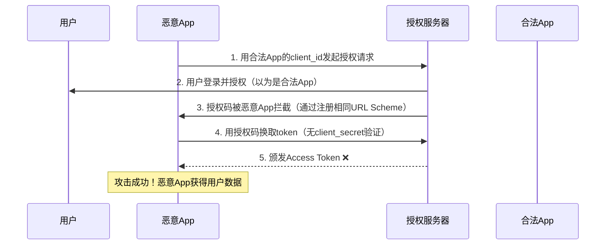
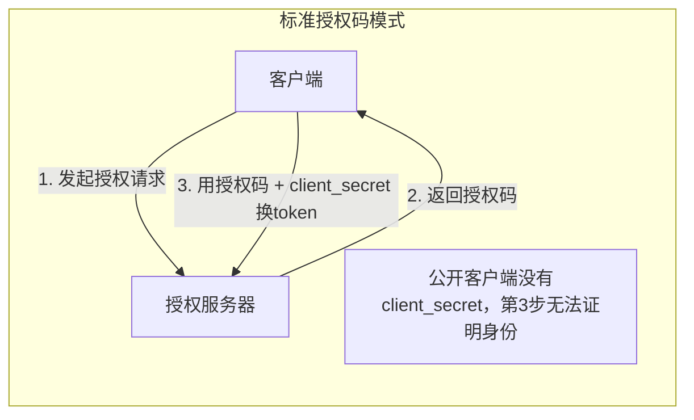
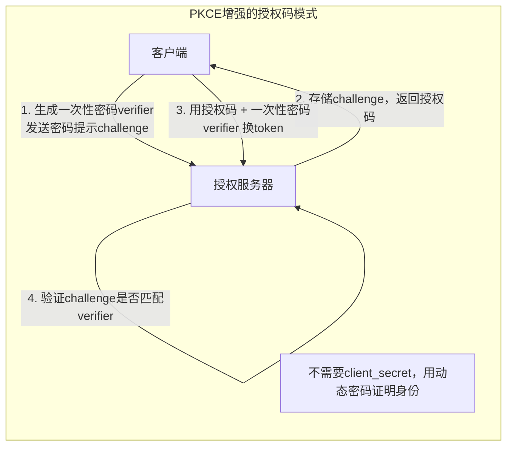
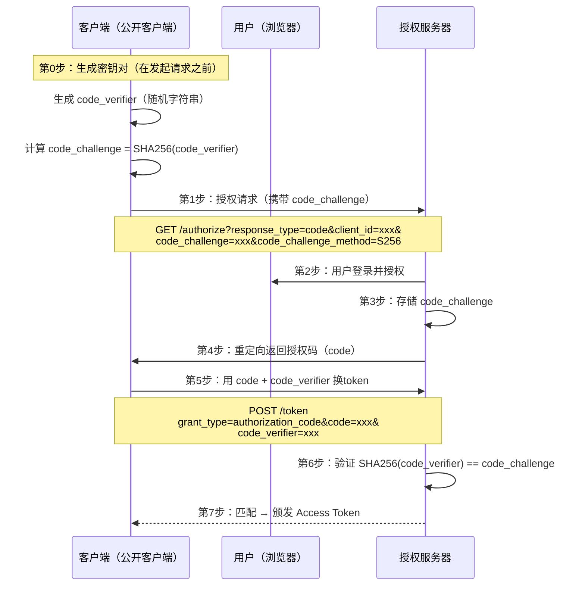

## 课程目标

- 理解公开客户端（移动App/单页应用）无法安全保存`client_secret`的根本原因
- 掌握授权码拦截攻击的原理和危害
- 深入理解PKCE的核心机制——为什么"动态密码"比"静态密码"更安全
- 完整掌握PKCE增强的授权码流程，包括`code_verifier`和`code_challenge`的生成与验证
- 能够在Postman中配置并测试PKCE流程

## 回顾与引入：标准授权码模式还"不够"吗？

在上一讲中，我们深入学习了授权码模式的完整流程，知道了它为什么是OAuth2中最安全的模式——因为Access Token从不经过浏览器，只在服务器之间的"后台通道"传输。

但你可能注意到了：**授权码模式有一个隐含的前提——客户端必须有一个"后端"，能够安全地保存`client_secret`。**

在"后端用code换取token"的这一步请求中，客户端需要携带`client_secret`来证明"我就是我"：

```http
POST /token HTTP/1.1
Host: authorization-server.com
Content-Type: application/x-www-form-urlencoded

grant_type=authorization_code&
code=AUTH_CODE_12345&
client_id=your-client-id&
client_secret=your-client-secret   ← 这个秘密必须安全保存
```

**问题来了：如果一个应用根本没有"后端"呢？**

### 两类客户端的命运

在第2讲中，我们介绍了OAuth2对客户端的两种分类：

| 客户端类型     | 定义                               | 典型例子                                                | 能否保存`client_secret`？ |
| -------------- | ---------------------------------- | ------------------------------------------------------- | ------------------------- |
| **机密客户端** | 有服务端后端，能安全保存秘密       | 传统Web应用（Java Spring Boot + 后端渲染）              | ✅ 能                     |
| **公开客户端** | 无服务端后端，代码在用户设备上运行 | 单页应用（React/Vue）、移动App（iOS/Android）、桌面应用 | ❌ 不能                   |

**机密客户端**（如一个Java Spring Boot Web应用）——它的`client_secret`保存在服务器上，只有服务器管理员能访问，外界无法获取。所以它可以使用完整的授权码模式。

**公开客户端**（如一个React单页应用，或一个Android手机App）——它的所有代码都运行在用户的设备上。如果我们在前端代码中硬编码一个`client_secret`，任何用户都可以打开Chrome开发者工具或反编译APK文件，看到这个秘密。

> [!WARNING]
>
> **"公开客户端"的"公开"不是指"应用是开源的"，而是指"应用的代码在用户的设备上运行，任何人都可以查看"。** 一个闭源的商业App，只要它运行在用户的手机上，它的代码就可以被反编译——这就是"公开"的含义。

### 一个场景实验

想象一下这样的场景：

你是一个开发者，正在开发一个叫"轻图"的React单页应用（SPA）。用户使用"轻图"编辑照片后，可以一键保存到自己的百度网盘。

"轻图"要访问百度网盘，必须使用OAuth2授权码模式。

**问题**："轻图"是一个纯前端应用，没有后端服务器。它无法安全保存`client_secret`。

**如果"轻图"把`client_secret`写在前端代码里**：

```javascript
// 轻图的前端代码（任何人都可以看到）
const CLIENT_SECRET = "abc123xyz"; // ← 这个秘密公开了！
```

任何用户打开浏览器的开发者工具，都能看到这行代码，拿到`client_secret`。然后攻击者可以用这个`client_secret`冒充"轻图"应用，获取用户的授权。

**那如果"轻图"不提供`client_secret`呢？**

回顾授权码模式的第5步——换取token的请求中需要`client_secret`。如果没有`client_secret`，授权服务器怎么知道"拿着code来换token的这个客户端，就是当初发起授权请求的那个客户端"？

**这就是公开客户端面临的核心困境**：标准的授权码模式依赖`client_secret`来验证客户端的身份，但公开客户端无法安全地保存`client_secret`。没有`client_secret`，授权码模式的安全性就出现了一个缺口——拿到授权码的人就能换取token。**PKCE就是为填补这个缺口而生的。**

## PKCE要解决的核心问题：授权码拦截攻击

### 什么是授权码拦截攻击？

在标准的OAuth2授权码流程中，授权码（code）是通过浏览器重定向传输的——从授权服务器到客户端的回调地址。在这个过程中，授权码暴露在浏览器的URL中。

对于有后端的机密客户端来说，这个风险是可控的——因为即使攻击者截获了授权码，他也没有`client_secret`来换取token。

**但对于公开客户端来说，情况完全不同**——公开客户端没有`client_secret`。这意味着：**任何拿到授权码的人，都可以直接用它换取Access Token**。



> [!WARNING]
>
> **问题的关键在于**：仅凭授权码，不足以证明"换token的客户端"就是"当初发起授权请求的那个客户端"。在公开客户端场景下，授权码成了一个"谁捡到谁就能用"的一次性凭证——而攻击者要做的，就是在授权码从授权服务器返回客户端的路上"截胡"。

### 在移动端，这种攻击尤其容易发生

在移动端（iOS/Android），应用之间可以通过"自定义URL Scheme"进行通信。例如，一个App可以注册`myapp://`作为自己的URL Scheme。

攻击者的手段是这样的：

1. 攻击者开发一个恶意App，注册了和合法App相同的自定义URL Scheme
2. 用户在使用合法App时，触发了OAuth2授权流程
3. 授权服务器将授权码通过重定向发送到`myapp://callback?code=xxx`
4. **操作系统的URL Scheme分发起机制无法区分"哪个App注册了这个Scheme"** ——如果两个App注册了相同的Scheme，系统可能会让用户选择，也可能直接交给先注册的那个
5. 恶意App拦截到了授权码
6. 恶意App立即用授权码换取Access Token

> [!NOTE]
>
> 这不是理论上的攻击——这是真实存在过的安全漏洞。这也是为什么Auth0等主流授权服务商**强烈不推荐**使用自定义URI Scheme来接收回调。

### 在单页应用（SPA）中，风险同样存在

在浏览器环境中，攻击者可能通过以下方式截获授权码：

- **恶意浏览器插件**：读取浏览器地址栏中的URL
- **中间人攻击**：在HTTP（非HTTPS）网络中截获请求
- **Referer头泄露**：页面中的外部资源请求会携带完整的URL（含授权码）
- **浏览器历史记录**：授权码出现在URL中，被保存在历史记录里

## PKCE的设计动机：从"静态密码"到"动态密码"

### 核心思想：一次性密码

PKCE（Proof Key for Code Exchange，发音为"pixy"）是OAuth2的一个安全扩展，定义在RFC 7636中。它的核心思想非常朴素：

> **让客户端在发起授权请求时，动态生成一个"一次性密码"的"提示"，然后在换取token时出示这个"密码"本身。授权服务器验证"密码"和"提示"是否匹配。**





### 类比：密码提示问题

想象你去一个高级会所，会所采用了一种特殊的身份验证方式：

**第一步（注册时）** ：

- 你设置了一个密码（比如"我爱北京天安门"）
- 你把密码的**哈希值**（比如"5d41402abc4b2a76b9719d911017c592"）告诉前台
- 前台记下了这个哈希值，但没有记你的密码

**第二步（验证时）** ：

- 你来到前台，说"我是之前注册的那个客人"
- 前台说："请出示你的密码"
- 你输入"我爱北京天安门"
- 前台计算哈希值，发现和之前记录的一致
- 验证通过！

**这个方案的安全性在哪里？**

- 即使攻击者截获了"哈希值"（前台记录的那个），他也无法反推出原始密码
- 攻击者无法伪造一个能产生相同哈希值的不同密码（哈希函数的抗碰撞性）
- 每次验证时，你需要出示原始的密码——而这个密码只有你知道

> [!TIP]
>
> **PKCE的工作原理和这个类比完全一样**：
>
> - `code_verifier` = 你的原始密码（只在客户端本地保存，**从不传输**）
> - `code_challenge` = 密码的哈希值（在网络上传输，被截获也无法反推出原始密码）
> - 换取token时出示`code_verifier` = 验证时出示原始密码
> - 授权服务器验证哈希是否匹配 = 前台验证哈希值是否一致

### 为什么"动态密码"比"静态密码"更安全？

| 对比维度             | `client_secret`（静态密码）      | `code_verifier`（动态密码）            |
| -------------------- | -------------------------------- | -------------------------------------- |
| **生成方式**         | 在授权服务器注册时生成，长期不变 | 每次授权请求**动态生成**，用完即弃     |
| **存储位置**         | 必须安全保存（公开客户端做不到） | 只在客户端内存中临时保存，**不持久化** |
| **是否在网络上传输** | 是（换取token时传输）            | **否**（从不传输，只传输其哈希值）     |
| **被截获的后果**     | 攻击者可永久冒充该客户端         | 攻击者拿到哈希值也无法反推出原始密码   |
| **有效期**           | 永久有效（直到被吊销）           | 单次授权流程有效                       |

> [!IMPORTANT]
>
> **PKCE的本质**：它用"每个请求动态生成的一次性密码"替代了"长期固定的`client_secret`"。即使攻击者截获了`code_challenge`（密码的哈希值），也无法反推出`code_verifier`（原始密码）。而换取token时必须出示`code_verifier`——只有生成它的客户端才知道这个值。

## PKCE的完整流程（7步详解）

PKCE是对标准授权码模式的增强，而不是替代。它保留了授权码模式的所有步骤，只是在**第1步**和**第5步**增加了新的参数。

### 全景图：PKCE增强的授权码流程



### 第0步（新增）：客户端生成`code_verifier`和`code_challenge`

**这是在发起授权请求之前，客户端在本地完成的两个操作**。

**Step 0.1：生成`code_verifier`**

`code_verifier`是一个**高熵的加密安全随机字符串**，满足以下要求：

| 属性     | 要求                                    |
| -------- | --------------------------------------- |
| 长度     | 43 到 128 个字符                        |
| 字符集   | `A-Z`、`a-z`、`0-9`、`-`、`.`、`_`、`~` |
| 生成方式 | 加密安全的随机数生成器（CSPRNG）        |

> [!NOTE]
>
> **为什么长度至少是43个字符？** 因为43个字符的随机字符串提供了足够的熵（约256比特），使得暴力破解在计算上不可行。长度上限128是为了避免不必要的传输开销。

**Step 0.2：计算`code_challenge`**

客户端对`code_verifier`进行哈希运算，生成`code_challenge`。

有两种方法：

| 方法    | 说明                                                      | 安全性                          |
| ------- | --------------------------------------------------------- | ------------------------------- |
| `plain` | 不做任何转换，直接使用`code_verifier`作为`code_challenge` | ❌ 不安全（相当于明文传输密码） |
| `S256`  | SHA-256哈希 + Base64URL编码                               | ✅ **强烈推荐**                 |

**S256方法的计算过程**：

```
code_challenge = BASE64URL-ENCODE( SHA256( ASCII(code_verifier) ) )
```

**示例**（来自RFC 7636的官方示例）：

```
code_verifier = "dBjftJeZ4CVP-mB92K27uhbUJU1p1r_wW1gFWFOEjXk"
code_challenge = "E9Melhoa2OwvFrEMTJguCHaoeK1t8URWbuGJSstw-cM"
```

### 第1步（修改）：授权请求中携带`code_challenge`

客户端发起授权请求时，在URL中增加两个新参数：

```http
GET /authorize?
    response_type=code&
    client_id=your-client-id&
    redirect_uri=https://your-app.com/callback&
    scope=profile%20email&
    state=random-state-string&
    code_challenge=E9Melhoa2OwvFrEMTJguCHaoeK1t8URWbuGJSstw-cM&
    code_challenge_method=S256
HTTP/1.1
Host: authorization-server.com
```

**新增参数详解**：

| 参数                    | 是否必填    | 说明                                                |
| ----------------------- | ----------- | --------------------------------------------------- |
| `code_challenge`        | ✅ 必填     | 由`code_verifier`计算得到的挑战值                   |
| `code_challenge_method` | ✅ 强烈推荐 | 使用的哈希方法，必须是`S256`（或`plain`，但不推荐） |

**关键观察**：

- 这个请求中**仍然没有`client_secret`** ——公开客户端本来就没有
- 新增的两个参数中，`code_challenge`是**密码的哈希值**，不是密码本身
- 即使攻击者截获了这个请求，也只能看到哈希值，无法反推出原始密码

### 第2-4步（不变）：用户登录授权，返回授权码

授权服务器收到授权请求后：

1. 验证`client_id`和`redirect_uri`（和标准流程一样）
2. **记录下`code_challenge`和`code_challenge_method`** （新增！与授权码绑定存储）
3. 用户登录并授权
4. 生成授权码（code），通过重定向返回给客户端

> [!NOTE]
>
> 授权服务器**不会验证**`code_challenge`的正确性——它只是存储下来，留到第6步再用。任何人都可以发送任意的`code_challenge`，授权服务器都会接受并存储。

### 第5步（修改）：换取token时携带`code_verifier`

客户端后端（如果有的话）或客户端本身，用授权码换取token时，在请求中增加`code_verifier`参数：

```http
POST /token HTTP/1.1
Host: authorization-server.com
Content-Type: application/x-www-form-urlencoded

grant_type=authorization_code&
code=AUTH_CODE_12345&
redirect_uri=https://your-app.com/callback&
client_id=your-client-id&
code_verifier=dBjftJeZ4CVP-mB92K27uhbUJU1p1r_wW1gFWFOEjXk
```

**关键观察**：

- 请求中**仍然没有`client_secret`**
- 但多了`code_verifier`——这就是第0步生成的原始随机字符串
- `code_verifier`**只在客户端本地保存**，从未在网络上传输过（直到现在）

### 第6步（新增）：授权服务器验证

授权服务器收到换取token的请求后，执行以下验证：

1. 根据`code`找到之前存储的`code_challenge`和`code_challenge_method`
2. 用相同的方法（`S256`）对请求中的`code_verifier`进行哈希计算
3. 比较计算结果和存储的`code_challenge`是否一致

**如果匹配** → 验证通过，颁发Access Token

**如果不匹配** → 拒绝请求，返回错误

### 第7步（不变）：颁发Access Token

验证通过后，授权服务器返回Access Token（和标准流程一样）。

## 为什么PKCE能防住授权码拦截攻击？

现在我们来回答一个关键问题：**在整个流程中，攻击者试图截获授权码并换取token——PKCE是如何防住他的？**

### 攻击场景还原

假设攻击者成功截获了授权码（code），现在他试图用这个code换取token。

**攻击者需要发送的请求**：

```http
POST /token HTTP/1.1
      grant_type=authorization_code&
      code=截获的授权码&
      client_id=合法客户端ID&
      code_verifier=???   ← 攻击者不知道这个值！
```

**攻击者卡在哪里了？**

攻击者不知道`code_verifier`——这个值只在合法客户端的本地内存中，从未在网络上传输过。

攻击者可能尝试：

- **暴力破解**：`code_verifier`是43-128位的随机字符串，有2^256种可能——暴力破解在计算上不可行
- **从`code_challenge`反推**：`code_challenge = SHA256(code_verifier)`，哈希函数是单向的——无法反推
- **使用其他值**：授权服务器会验证`SHA256(code_verifier) == code_challenge`——不匹配就拒绝

### 与标准授权码模式的对比

|                               | 标准授权码模式（机密客户端）   | 标准授权码模式（公开客户端） | PKCE增强（公开客户端）         |
| ----------------------------- | ------------------------------ | ---------------------------- | ------------------------------ |
| 客户端有`client_secret`？     | ✅ 有                          | ❌ 没有                      | ❌ 没有                        |
| 授权码被截获后，能换token吗？ | ❌ 不能（需要`client_secret`） | ✅ **能**（无额外验证）      | ❌ 不能（需要`code_verifier`） |
| 安全性保障                    | `client_secret`                | **无保障**（漏洞！）         | `code_verifier`                |

> [!NOTE]
>
> **PKCE本质上是为公开客户端"补上了"标准授权码模式中缺失的客户端身份验证环节**。它用动态的`code_verifier`替代了静态的`client_secret`，使得公开客户端也能享受到"即使授权码被截获也无法被滥用"的安全保障。

## PKCE的演进：从"推荐"到"强制"

### OAuth 2.0时代：PKCE是可选的

在OAuth 2.0规范中，PKCE是一个**可选的安全扩展**。它被推荐用于公开客户端（移动App和SPA），但不是强制要求。

问题是：很多开发者不知道PKCE的存在，或者觉得"麻烦"就不用了。这导致大量公开客户端应用暴露在授权码拦截攻击的风险中。

### OAuth 2.1时代：PKCE是强制的

OAuth 2.1是OAuth 2.0的"安全增强版本"，它做了以下关键改变：

| 改变         | OAuth 2.0                | OAuth 2.1              |
| ------------ | ------------------------ | ---------------------- |
| 隐式模式     | 允许（用于SPA）          | **彻底移除**           |
| 密码模式     | 允许                     | **废弃**               |
| PKCE         | 可选（仅推荐公开客户端） | **所有客户端强制要求** |
| Token在URL中 | 允许                     | **禁止**               |

> [!IMPORTANT]
>
> **OAuth 2.1的核心变化**：授权码模式 + PKCE 成为**所有客户端类型**（机密服务器、SPA、移动App）的唯一推荐方案。隐式模式和密码模式都被移除了。

这意味着什么？

- **即使你的应用有后端、能保存`client_secret`，OAuth 2.1也建议你使用PKCE**
- PKCE不再是"移动端/SPA专用"，而是**所有OAuth2实现的最佳实践**
- 主流服务商已经开始执行这一标准

## 实践环节：在Postman中配置PKCE流程

本实践的目标是让同学们亲手在Postman中配置并完成一次PKCE增强的授权码流程，感受它与标准授权码模式的差异。

> [!NOTE]
>
> 请注意，市面上不同的OAuth2服务器对于授权模式的支持程度不尽相同。测试下来发现OAuthBin这个框架并不支持授权码+PKCE的功能，所以无法获取完整的Token结果。所以在本节内容中我们选择**Beeceptor 的 OAuth Mock 服务**来调试授权码+PKCE模式

### 准备工作

- 已安装 Postman
- 能够访问Beeceptor 的 OAuth Mock 服务（地址：`https://oauth-mock.mock.beeceptor.com`）

### 操作步骤

**Step 1：新建请求并配置OAuth 2.0**

1. 在Postman中新建一个`GET`请求
2. URL输入：`https://httpbin.io/get`（回显服务，用于验证token是否有效）
3. 切换到**Authorization**选项卡
4. Type选择**OAuth 2.0**
5. 点击**Configure New Token**

**Step 2：填写OAuth 2.0配置**

在配置窗口中，填写以下参数：

| 配置项                | 填入的值                                                 | 说明                                              |
| --------------------- | -------------------------------------------------------- | ------------------------------------------------- |
| Token Name            | PKCE测试令牌                                             | 自定义名称                                        |
| **Grant Type**        | **Authorization Code (With PKCE)**                       | **直接选择PKCE增强的授权码模式**                  |
| Callback URL          | https://httpbin.io/get                                   | 公共回显服务，用于接收授权码                      |
| Auth URL              | https://oauth-mock.mock.beeceptor.com/oauth/authorize    | OAuth Mock 服务的授权端点                         |
| Access Token URL      | https://oauth-mock.mock.beeceptor.com/oauth/token/google | OAuth Mock 服务的令牌端点（使用Google的令牌风格） |
| Client ID             | 任意                                                     | 测试客户端ID                                      |
| Client Secret         | （留空）                                                 | **公开客户端不需要**                              |
| Scope                 | photo                                                    | 请求的权限范围                                    |
| State                 | sample                                                   | 用于防CSRF攻击                                    |
| Client Authentication | Send client credentials in body                          | 通过请求体发送凭证                                |

> [!NOTE]
>
> 选择 **`Authorization Code (With PKCE)`** 后，Postman会自动完成以下操作：
>
> - 生成一个随机的`code_verifier`
> - 计算`code_challenge`（使用S256方法）
> - 在授权请求中自动添加`code_challenge`和`code_challenge_method=S256`
> - 在换取token的请求中自动添加`code_verifier`
>
> 整个过程对用户完全透明，你不需要手动生成任何值。

**Step 3：获取Token**

1. 点击**Get New Access Token**
2. Postman会打开浏览器窗口，跳转到OAuth Mock服务的授权服务器
3. 输入任意用户名和密码（OAuth Mock服务不校验真实性）
4. 点击"授权"或"Allow"
5. 观察浏览器地址栏中的URL——注意其中包含了`code_challenge`参数
6. 授权完成后，Postman自动完成token交换

> [!NOTE]
>
> 请注意，测试下来发现OAuthBin这个框架并不支持授权码+PKCE的功能，所以获取完整的Token结果。但所有通过Postman发送的请求都是严格符合PKCE规范和参数要求的。

**Step 4：观察PKCE的完整请求**

在Postman中查看请求详情，可以看到：

**授权请求的完整URL**（包含`code_challenge`）：

```http
http://localhost:4321/authorize?
    response_type=code&
    client_id=20260104.apps.localhost&
    redirect_uri=https://httpbin.io/get&
    scope=photo&
    state=sample&
    code_challenge=E9Melhoa2OwvFrEMTJguCHaoeK1t8URWbuGJSstw-cM&
    code_challenge_method=S256
```

**换取token的请求体**（包含`code_verifier`）：

```http
http://localhost:4321/api/token请求体字段：
    grant_type: "authorization_code"
    code: "a2e1a33b-e2ae-43e2-b8ff-4bb81d24c55e"
    redirect_uri: "https://httpbin.io/get"
    code_verifier: "89eRlAAWrLXHTlh1Z4wGm-_eeUr-jZVRk6DcnAs9UEI"
    client_id: "*****"
```

**Step 5：对比——使用普通授权码模式（无PKCE）**

1. 在OAuth 2.0配置中，将 **Grant Type** 改为 **`Authorization Code`**（无PKCE的普通模式）
2. 再次点击**Get New Access Token**
3. 观察授权请求的URL——**没有**`code_challenge`参数
4. 观察换取token的请求体——**没有**`code_verifier`参数

### 观察要点

| 对比项                                    | 普通授权码模式 （`Authorization Code`） | PKCE增强 （`Authorization Code (With PKCE)`） |
| ----------------------------------------- | --------------------------------------- | --------------------------------------------- |
| Grant Type 选项                           | `Authorization Code`                    | `Authorization Code (With PKCE)`              |
| 授权请求中是否有`code_challenge`？        | ❌ 无                                   | ✅ 有                                         |
| 授权请求中是否有`code_challenge_method`？ | ❌ 无                                   | ✅ 有（S256）                                 |
| 换token请求中是否有`code_verifier`？      | ❌ 无                                   | ✅ 有                                         |
| 是否需要`client_secret`？                 | 公开客户端不需要                        | 公开客户端不需要                              |
| 授权码被截获后能否换token？               | ✅ **能**（风险！）                     | ❌ **不能**（安全！）                         |

## 本讲小结

本节课我们学习了：

1. **公开客户端的困境**：
   - 移动App和SPA无法安全保存`client_secret`
   - 标准授权码模式在公开客户端场景下存在安全缺口

2. **授权码拦截攻击**：
   - 攻击者截获授权码后，可以直接换取token
   - 在移动端（URL Scheme劫持）和浏览器端（恶意插件、Referer泄露）都容易发生

3. **PKCE的核心机制**：
   - `code_verifier`：高熵随机字符串（43-128字符），只在客户端本地保存
   - `code_challenge`：`code_verifier`的SHA-256哈希值，在网络上传输
   - 换取token时必须出示`code_verifier`，授权服务器验证哈希匹配

4. **PKCE的安全保证**：
   - 即使授权码被截获，攻击者没有`code_verifier`也无法换token
   - `code_verifier`从未在网络上传输，攻击者无法获取

5. **OAuth 2.1的演进**：
   - PKCE从"可选"变为"强制"

   - 隐式模式和密码模式被移除

   - 授权码模式 + PKCE 成为所有客户端的唯一推荐方案
