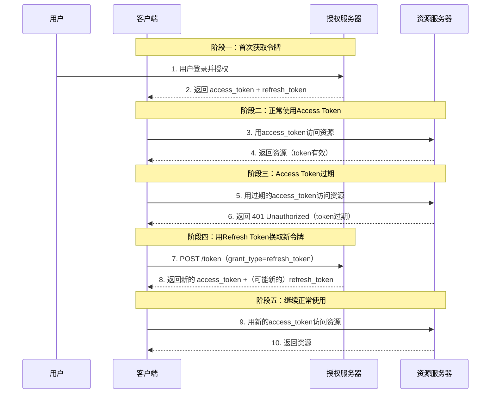
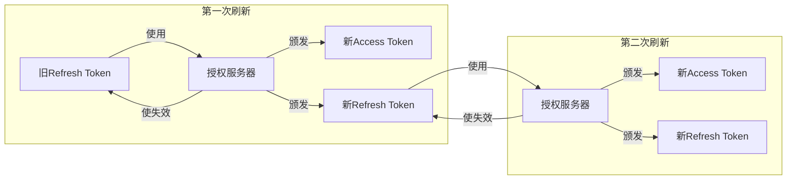
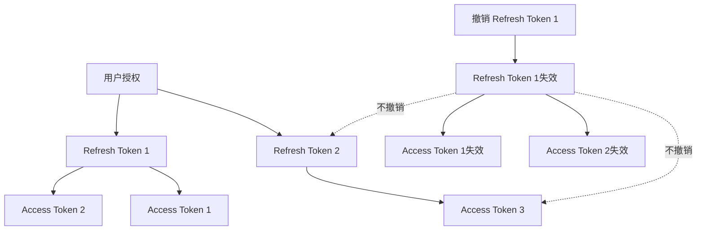

## 课程目标

- 理解Access Token短时效的设计原因和Refresh Token的作用
- 掌握Refresh Token的完整刷新流程和请求/响应格式
- 深入理解Refresh Token Rotation（轮换）机制及其防重放攻击的原理
- 理解令牌撤销（Revocation）的机制和应用场景

## 回顾与引入：我们已经拿到了令牌，然后呢？

在前六讲中，我们完整学习了OAuth2/OIDC的认证授权体系：

- 第1-2讲：OAuth2解决了什么问题，四个角色是什么
- 第3讲：四种授权模式如何选择
- 第4讲：授权码模式的完整流程和设计动机
- 第5讲：PKCE如何为公开客户端提供安全保障
- 第6讲：OIDC如何通过ID Token解决"用户是谁"的问题

一路走来，我们学会了**如何获取Access Token**。但获取令牌只是开始——真正的挑战在于**如何管理好这些令牌的生命周期**。

### 一个值得思考的问题

想象一下这个场景：

> 你开发了一个叫"云笔记"的应用，用户通过Google账号登录后，应用获得了Access Token，可以访问用户的Google Drive来备份笔记。
>
> 问题是：**这个Access Token的有效期通常只有1小时。1小时后，用户正在写一篇很长的笔记，突然应用弹出"请重新登录"——用户的体验彻底毁了。**

**怎么办？**有两种思路：

**思路一**：把Access Token的有效期设得很长，比如30天。

这样做的后果：如果这个长期有效的Access Token被黑客窃取了，黑客可以在接下来的30天里随意访问用户的Google Drive——这是一个巨大的安全漏洞。

**思路二**：Access Token保持短时效（1小时），但提供一种机制让应用**在用户无感知的情况下**自动获取新的Access Token。

> [!IMPORTANT]
> **第二种思路就是Refresh Token（刷新令牌）诞生的原因。** 它实现了"安全"和"体验"的平衡——Access Token短时效保证安全，Refresh Token长时效保证用户体验。

### 一个生活类比

想象你去一家高级健身房：

| **Access Token**                  | **Refresh Token**                                  |
| --------------------------------- | -------------------------------------------------- |
| 一张**临时手环**，有效期只有2小时 | 你的**会员卡**，有效期1年                          |
| 凭手环可以进入健身房的所有区域    | 凭会员卡可以在前台**换领新手环**                   |
| 手环丢了，小偷只能在这2小时内使用 | 会员卡丢了，小偷可以不断地换领新手环——**风险更大** |
| 2小时后手环失效，需要去前台换新的 | 会员卡长期有效，可以反复使用                       |

> [!NOTE]
> **Access Token = 临时手环（短时效，高风险暴露）**
> **Refresh Token = 会员卡（长时效，低频率使用，需要更严格保护）**

### Access Token 的有效时间是多少？

Bearer Token 的本质：**谁持有谁使用**。在OAuth2中，Access Token是一种**Bearer Token（持有者令牌）** ——这意味着：**谁持有这个令牌，谁就能用它来访问资源。**

授权服务器和资源服务器**不会验证**"使用这个令牌的人是不是当初获得令牌的那个人"。它们只验证一件事：**这个令牌本身是否有效**。

> [!TIP]
> **业界最佳实践**：Access Token的有效期通常设置为**15-30分钟**。这个时长足以完成正常的API调用，又足够短以限制令牌泄露后的影响范围。

Access Token短时效是"安全"的需要，但用户体验怎么办？用户不可能每15-30分钟重新登录一次——那会让任何应用都无法使用。**Refresh Token就是来解决这个矛盾的。**

## Refresh Token 是什么？

### 正式定义

根据RFC 6749（OAuth 2.0核心规范），Refresh Token是"一种用于在不需要资源拥有者重新认证的情况下获取Access Token的凭证"。

**一句话总结**：Refresh Token是一个**长期有效的凭证**，它的唯一用途就是**换取新的Access Token**。

### Refresh Token 的核心特征

| 特征                   | 说明                                                                        |
| ---------------------- | --------------------------------------------------------------------------- |
| **长时效**             | 通常有效期为数天到数周（如7天、30天）                                       |
| **低频使用**           | 只在Access Token过期时使用，不是每次API调用都用                             |
| **高价值凭证**         | 因为可以换取新的Access Token，泄露后果更严重                                |
| **仅与授权服务器交互** | 只发送给授权服务器的`/token`端点，**资源服务器不应接收或处理Refresh Token** |
| **可被撤销**           | 用户退出登录或撤销授权时，可以废除Refresh Token                             |

### Access Token vs Refresh Token 对比

| 对比维度               | Access Token                  | Refresh Token                    |
| ---------------------- | ----------------------------- | -------------------------------- |
| **主要用途**           | 访问受保护资源（调用API）     | 换取新的Access Token             |
| **有效期**             | 短（15-30分钟）               | 长（数天到数周）                 |
| **使用频率**           | 高（每次API调用）             | 低（仅在token过期时）            |
| **暴露范围**           | 在每次API请求中传输，暴露面大 | 仅在换取token时传输，暴露面小    |
| **泄露后果**           | 攻击者在有效期内可访问资源    | 攻击者可反复换取新的Access Token |
| **存储要求**           | 相对宽松                      | **更严格**（高价值凭证）         |
| **资源服务器是否可见** | ✅ 是（每次API请求都携带）    | ❌ 否（资源服务器不应看到）      |

## Refresh Token 的完整刷新流程

### 全景图：Access Token从获取到刷新的完整生命周期



### Refresh Token 刷新的 HTTP 请求

当Access Token过期后，客户端向授权服务器的`/token`端点发送以下请求：

```http
POST /token HTTP/1.1
Host: authorization-server.com
Content-Type: application/x-www-form-urlencoded

grant_type=refresh_token&
refresh_token=REFRESH_TOKEN_STRING&
client_id=your-client-id&
client_secret=your-client-secret
```

**请求参数详解**：

| 参数            | 是否必填  | 说明                                                |
| --------------- | --------- | --------------------------------------------------- |
| `grant_type`    | ✅ 必填   | 必须为`refresh_token`，告诉授权服务器"我在刷新令牌" |
| `refresh_token` | ✅ 必填   | 之前获得的Refresh Token字符串                       |
| `client_id`     | ✅ 必填   | 客户端的公开标识                                    |
| `client_secret` | ⚠️ 视情况 | 机密客户端必填，公开客户端（如使用了PKCE）可以不填  |
| `scope`         | 可选      | 可以请求缩小权限范围（不能扩大）                    |

### Refresh Token 刷新的响应

授权服务器验证Refresh Token有效后，返回新的令牌：

```json
{
  "access_token": "NEW_ACCESS_TOKEN_STRING",
  "token_type": "Bearer",
  "expires_in": 3600,
  "refresh_token": "NEW_OR_SAME_REFRESH_TOKEN",
  "scope": "profile email"
}
```

**关键观察**：

- 返回了**新的Access Token**（必须的）
- 是否返回**新的Refresh Token**，取决于授权服务器的策略——这就是下面要讲的**Refresh Token Rotation**

## Refresh Token Rotation（令牌轮换）——核心安全机制

### 什么是 Refresh Token Rotation？

**Refresh Token Rotation（刷新令牌轮换）** 是指：**每次使用Refresh Token换取新的Access Token时，授权服务器同时颁发一个新的Refresh Token，并使旧的Refresh Token失效**。



> [!IMPORTANT]
> **核心原则**：每个Refresh Token只能使用一次。使用后立即失效，同时颁发一个新的Refresh Token。

### 为什么需要 Rotation？——防止 Refresh Token 被重用

如果没有Rotation，一个Refresh Token被窃取后，攻击者和合法用户可以**同时使用**同一个Refresh Token换取Access Token——双方都能成功，授权服务器无法区分谁是谁。

有了Rotation之后：

1. 合法用户使用Refresh Token 1换取新令牌 → 授权服务器颁发Refresh Token 2，**使Refresh Token 1失效**
2. 攻击者试图用偷来的Refresh Token 1换取令牌 → 授权服务器发现"这个Token已经失效了" → **拒绝请求，并触发安全告警**

> [!NOTE]
> **自动重用检测（Automatic Reuse Detection）** ：当一个已经被使用过的Refresh Token再次被使用时，授权服务器会识别出这可能是一次重放攻击或令牌被盗，并立即**使整个Token Family（令牌家族）失效**，强制用户重新认证。

### Token Family（令牌家族）机制

当Refresh Token发生轮换时，每一次新颁发的Refresh Token都与前一个Token形成一条"链"：

```
原始授权 → Refresh Token 1 → Refresh Token 2 → Refresh Token 3 → ...
              (家族ID: family-123)
```

所有这些Token属于同一个**Token Family（令牌家族）**。

**家族机制的安全价值**：

- 如果攻击者偷到了Refresh Token 1，而合法用户已经轮换到了Refresh Token 2
- 攻击者试图使用Refresh Token 1时，授权服务器检测到"这个Token属于家族family-123，但家族中已经有更新的Token被使用了"
- 授权服务器立即**使整个家族失效**——Refresh Token 1、2、3全部作废
- 合法用户和攻击者都无法继续使用任何Refresh Token，**双方都需要重新认证**

> [!CAUTION]
> **这就是"检测到令牌被盗后，宁可牺牲所有人的会话，也不让攻击者得逞"的安全策略。** 虽然合法用户会被强制重新登录，但这比让攻击者持续访问用户数据要安全得多。

### Rotation 的"优雅降级"问题

在实际应用中，Refresh Token Rotation可能遇到一个实际问题：**网络延迟或并发请求**。

想象这个场景：

1. 客户端同时发起了两个并发的API请求
2. 两个请求都发现Access Token过期了
3. 两个请求**同时**使用同一个Refresh Token去换取新令牌

如果Refresh Token是"一次性"的，第一个请求成功了（获得了新Token，旧Token失效），第二个请求就会失败——因为旧Token已经被用过了。

**解决方案**：

- **最佳实践**：客户端应该**串行化**Refresh Token的刷新操作——在刷新完成之前，所有其他请求排队等待
- **临时方案**：一些授权服务器支持"优雅刷新"（Graceful Refresh），在短时间内允许同一个Refresh Token被多次使用——但这不是推荐做法，因为它**削弱了Rotation的安全价值**

## 令牌的撤销（Revocation）

### 什么是令牌撤销？

**令牌撤销（Token Revocation）** 是指客户端或授权服务器主动使一个令牌失效的过程。

RFC 7009定义了OAuth 2.0令牌撤销的标准机制。

**为什么需要撤销？**

| 场景             | 说明                                                   |
| ---------------- | ------------------------------------------------------ |
| **用户退出登录** | 用户主动登出时，应撤销所有令牌，确保登出后无法继续访问 |
| **令牌泄露**     | 检测到令牌可能被窃取时，应立即撤销                     |
| **用户撤销授权** | 用户在授权服务器上撤销了对某个客户端的授权             |
| **应用卸载**     | 用户卸载了应用，应清理所有令牌                         |
| **权限变更**     | 用户的权限发生了变化，需要强制重新授权                 |

### 撤销请求的格式

根据RFC 7009，客户端向授权服务器的撤销端点发送POST请求：

```http
POST /revoke HTTP/1.1
Host: authorization-server.com
Content-Type: application/x-www-form-urlencoded

token=REFRESH_TOKEN_STRING&
token_type_hint=refresh_token&
client_id=your-client-id&
client_secret=your-client-secret
```

**参数详解**：

| 参数              | 是否必填  | 说明                                                                    |
| ----------------- | --------- | ----------------------------------------------------------------------- |
| `token`           | ✅ 必填   | 要撤销的令牌（Access Token或Refresh Token）                             |
| `token_type_hint` | 可选      | 提示令牌类型（`access_token`或`refresh_token`），帮助授权服务器优化查找 |
| `client_id`       | ✅ 必填   | 客户端的公开标识                                                        |
| `client_secret`   | ⚠️ 视情况 | 机密客户端必填                                                          |

**成功响应**：

```
HTTP/1.1 200 OK
```

（空响应体，表示撤销成功）

**错误响应**：

```http
HTTP/1.1 400 Bad Request
{
    "error": "invalid_request",
    "error_description": "Missing token parameter"
}
```

### 撤销的级联效应

撤销一个Refresh Token时，**可能会连带撤销基于同一授权颁发的其他令牌**：



> [!NOTE]
> **撤销粒度**：不同的授权服务器实现可能不同。有些只撤销指定的Token，有些会撤销整个授权（所有基于同一授权颁发的Token）。客户端在实现撤销功能时，应准备好处理"撤销后所有关联Token都失效"的情况。

### 撤销 vs 过期

| 对比维度     | 过期（Expiration）         | 撤销（Revocation）                   |
| ------------ | -------------------------- | ------------------------------------ |
| **触发方**   | 授权服务器（自动）         | 客户端或授权服务器（主动）           |
| **时机**     | 预定的时间点               | 任何时间（需要时）                   |
| **速度**     | 可预期（到期才生效）       | 立即生效                             |
| **用途**     | 限制令牌的**默认生命周期** | 应对**异常情况**（泄露、退出登录等） |
| **是否可逆** | 不可逆（过期后无法恢复）   | 不可逆（撤销后无法恢复）             |

> [!TIP]
> **过期是"定期换锁"，撤销是"发现钥匙丢了立刻换锁"。** 两者结合使用，才能构成完整的令牌生命周期管理。

## 安全最佳实践总结

### 令牌生命周期管理清单

| 实践                           | 说明                                            |
| ------------------------------ | ----------------------------------------------- |
| **Access Token短时效**         | 设置为15-30分钟，不超过1小时                    |
| **Refresh Token有时效**        | 根据场景设置（移动端30天，服务端24小时等）      |
| **启用Refresh Token Rotation** | 每次刷新颁发新Refresh Token，旧Token失效        |
| **启用重用检测**               | 检测到已失效的Refresh Token被使用，触发安全告警 |
| **令牌加密存储**               | 使用AES-256-GCM等算法加密存储                   |
| **不记录明文令牌**             | 日志中只记录Token ID，不记录Token值             |
| **使用HTTPS**                  | 所有令牌传输必须通过HTTPS                       |
| **实现撤销端点**               | 支持RFC 7009标准的令牌撤销                      |
| **定期清理过期令牌**           | 从数据库中删除已过期或被撤销的令牌              |

### 常见错误与规避

| 错误做法                               | 风险                  | 正确做法                    |
| -------------------------------------- | --------------------- | --------------------------- |
| Access Token有效期设得太长（如24小时） | 泄露后影响范围大      | 设为15-30分钟               |
| Refresh Token不轮换                    | 被窃取后可无限使用    | 每次刷新颁发新Refresh Token |
| 将Refresh Token存储在LocalStorage      | XSS攻击可窃取         | 使用服务端存储              |
| 在日志中打印Refresh Token              | 日志泄露导致Token泄露 | 只记录Token ID              |
| 不实现撤销功能                         | 用户退出后Token仍有效 | 实现RFC 7009撤销端点        |

## 实践环节：在Postman中体验Refresh Token刷新与撤销

本实践的目标是让同学们亲手在Postman中完成Refresh Token的刷新和撤销操作，感受令牌生命周期的完整管理。

### 准备工作

- 已安装 Postman
- 能够访问OAuthBin本地服务

### 实验一：获取包含Refresh Token的令牌对

**操作步骤**：

1. 在Postman中配置OAuth 2.0授权（使用授权码模式 ）：

   | 配置项                | 填入的值                        | 说明                               |
   | --------------------- | ------------------------------- | ---------------------------------- |
   | Token Name            | 测试令牌                        | 只是一个名称，方便你识别           |
   | Grant Type            | Authorization Code              | 使用最标准的授权码模式             |
   | Callback URL          | https://httpbin.io/get          | 一个公共的回显服务，用于接收授权码 |
   | Auth URL              | http://localhost:4321/authorize | 授权服务器的授权端点               |
   | Access Token URL      | http://localhost:4321/api/token | 授权服务器的令牌端点               |
   | Client ID             | 20260104.apps.localhost         | 预置的测试客户端ID                 |
   | Client Secret         | 20260104.secret                 | 预置的测试客户端密钥               |
   | Scope                 | photo                           | 请求的权限范围                     |
   | State                 | sample                          | 用于防CSRF攻击，可以随便填         |
   | Client Authentication | Send client credentials in body | 选择通过请求体发送凭证             |

2. 点击 **Get New Access Token**，完成授权流程（输入任意用户名密码）
3. 观察返回的完整响应

### 实验二：手动刷新Access Token

**操作步骤**：

1. 从实验一的响应中复制`refresh_token`的值
2. 在Postman中新建一个`POST`请求
3. URL输入：http://localhost:4321/api/token
4. Body选择`x-www-form-urlencoded`，填写以下参数：

| 参数          | 值                        |
| ------------- | ------------------------- |
| grant_type    | refresh_token             |
| refresh_token | 上一步复制的Refresh Token |
| client_id     | 20260104.apps.localhost   |
| client_secret | 20260104.secret           |

点击 **Send**，观察响应

**观察要点**：

- 返回了**新的Access Token**（与实验一不同）
- **关键**：如果授权服务器支持 Rotation，还会返回**新的Refresh Token**
- 如果 OAuthBin返回了新的 Refresh Token，说明它支持 Rotation；如果返回了相同的 Refresh Token，说明它不支持 Rotation

### 实验三：验证Refresh Token的一次性（Rotation验证）

**操作步骤**：

1. 再次使用**同一个旧的Refresh Token**发送刷新请求（和实验二一样）
2. 观察响应

> [!NOTE]
> 这就是Refresh Token Rotation的核心验证——旧的Refresh Token一旦被使用，立即失效，无法再次使用。

### 关于令牌撤销的说明

OAuthBin和Beeceptor Mock 服务**暂不支持** RFC 7009 规范的撤销端点（`/revoke`），因此本实验不包含撤销的实操环节。

**但在生产环境中，撤销是必须实现的功能**，其请求格式为：

```http
POST /revoke HTTP/1.1
Host: authorization-server.com
Content-Type: application/x-www-form-urlencoded

token=REFRESH_TOKEN_STRING&
token_type_hint=refresh_token&
client_id=your-client-id&
client_secret=your-client-secret
```

## 本讲小结

本节课我们学习了：

1. **Access Token为什么必须短时效**：
   - Bearer Token的本质：谁持有谁使用
   - 短时效限制令牌泄露后的攻击窗口
2. **Refresh Token的作用**：
   - 在用户无感知的情况下换取新的Access Token
   - 实现"安全"和"体验"的平衡
3. **Refresh Token Rotation（令牌轮换）** ：
   - 每次刷新颁发新的Refresh Token，旧Token失效
   - 通过重用检测发现令牌被盗
   - Token Family机制实现整族失效
4. **令牌撤销（RFC 7009）** ：
   - 主动使令牌失效的标准机制
   - 用户退出、令牌泄露、撤销授权等场景使用
