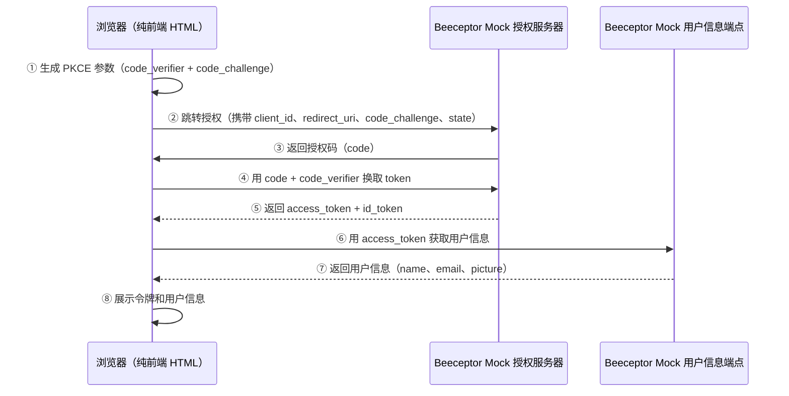
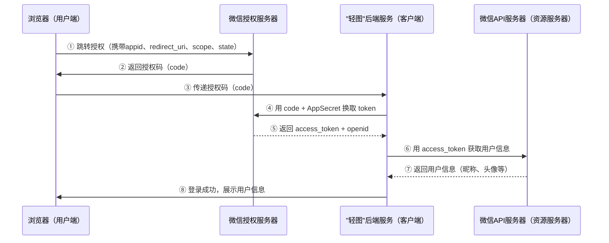

## 课程目标

- 使用纯前端 HTML + JavaScript，零后端依赖跑通 OAuth2 授权码模式 + PKCE 全流程
- 以"轻图"第三方应用为业务场景，深入理解微信 OAuth2 授权登录的完整实现原理
- 建立"协议标准"的思维方式——学会一种，就学会了所有

## 回顾：我们已经学了什么？

在前七讲中，我们完整学习了 OAuth2/OIDC 的理论体系：

| 讲次  | 核心内容                                                 |
| ----- | -------------------------------------------------------- |
| 第1讲 | OAuth2 诞生的背景：密码共享的四大致命问题                |
| 第2讲 | 四个关键角色：资源拥有者、客户端、授权服务器、资源服务器 |
| 第3讲 | 四种授权模式的选型决策                                   |
| 第4讲 | 授权码模式的 6 步完整流程与设计动机                      |
| 第5讲 | PKCE：公开客户端的安全增强方案                           |
| 第6讲 | OIDC：在 OAuth2 之上加一层身份认证                       |
| 第7讲 | 令牌生命周期管理：Refresh Token、存储与撤销              |

学到这里，你可能有一个困惑：

> **"前七讲全是理论和 Postman 模拟，到底能不能跑起来一个真正的 OAuth2 应用？"**

**本讲的目标就是回答这个问题。**

我们分两步走：

1. **先跑通一个可运行的 Demo**——用纯前端 HTML + Beeceptor Mock 服务，亲手感受 OAuth2 的每一个环节，理解回调地址的本质要求
2. **再深入理解真实实现**——以"轻图"接入微信登录为业务场景，剖析真实生产环境的实现路径

## 可运行的 Demo：用 Beeceptor Mock 跑通完整流程

本 Demo 旨在用纯前端技术复现 OAuth2 授权码模式 + PKCE 的完整交互，不依赖任何后端服务。用户只需在浏览器中打开一个 `HTML页面`即可：

- 自动生成符合 PKCE 规范的 `code_verifier` 和 `code_challenge`；
- 跳转到 Beeceptor Mock 授权服务器完成"模拟登录"（输入任意邮箱和密码）；
- 接收授权码回调，并用 `code_verifier` 换取 `access_token` 和 `id_token`；
- 使用 `access_token` 调用用户信息端点，获取并展示用户昵称、邮箱和头像。

整个过程模拟了真实 OAuth2 服务商（如微信、Google）的授权流程，但免去了域名备案、企业资质、审核等待等前置门槛，让开发者可以零成本、零配置地体验协议细节。



### 为什么选择 Beeceptor Mock OAuth 服务？

**真实 OAuth 服务的"拦路虎"**

以微信平台为例，微信登录的真实接入需要：

1. **已备案的域名**（不能是 localhost）
2. **企业资质**注册微信开放平台
3. **1-7 个工作日的应用审核**
4. **AppID 和 AppSecret** 等敏感凭证

对课堂教学来说门槛太高。

**Beeceptor 的解决方案**

Beeceptor 提供了一个**完全免费的公共 Mock OAuth 服务器**：

```
https://oauth-mock.mock.beeceptor.com
```

- **零配置**：无需注册、无需申请、无需审核
- **无验证**：接受任意 `client_id` 和 `client_secret`
- **全功能**：完整支持 `/authorize`、`/token`、`/userinfo`
- **真实感**：返回格式与真实 OAuth 提供商兼容

**Beeceptor Mock OAuth 端点**：

| 端点                  | 方法 | 说明                            |
| --------------------- | ---- | ------------------------------- |
| `/oauth/authorize`    | GET  | 显示登录页面，接受任意邮箱/密码 |
| `/oauth/token/google` | POST | 返回模拟的 Google 风格 Token    |
| `/oauth/token/github` | POST | 返回模拟的 GitHub 风格 Token    |
| `/userinfo/google`    | GET  | 返回模拟的 Google 用户信息      |
| `/userinfo/github`    | GET  | 返回模拟的 GitHub 用户信息      |

### 完整可运行的 HTML 代码

参考课件配套的`oauth-demo.html`文件

### 核心问题：OAuth2 回调为什么不能用 file:// 协议？

本案例的客户的是一个纯前端 HTML，如果你直接双击打开 HTML 文件（地址栏显示 `file:///Users/xxx/Desktop/demo.html`），点击登录后：

1. 页面跳转到 Beeceptor 授权服务器
2. 你输入任意账号密码，点击授权
3. **Beeceptor 尝试将授权码回调到你的 `file://` 地址**
4. **浏览器安全策略阻止了重定向** → 页面无法返回

**结果**：流程卡在授权服务器，永远回不到你的 Demo 页面。

**为什么会这样？**

| 问题                | 说明                                                    |
| ------------------- | ------------------------------------------------------- |
| **浏览器安全策略**  | 现代浏览器禁止从 HTTPS/HTTP 页面重定向到 `file://` 协议 |
| **OAuth2 规范要求** | `redirect_uri` 必须是有效的 HTTP/HTTPS URL              |
| **服务器无法回调**  | Beeceptor 是公网服务，无法访问你本地的 `file://` 路径   |

**这个问题的本质是什么？**

> [!IMPORTANT]
> **OAuth2 中的 `redirect_uri` 必须是一个"公网可访问的 HTTP/HTTPS 地址"。** `file://` 不是 HTTP 协议，localhost 对公网服务不可见——两者都无法被授权服务器回调。这是 OAuth2 安全模型的核心防线：授权码只能被发送到"可验证的、可追溯的"地址，防止被劫持到攻击者的服务器。

理解了这一点，你就会明白为什么微信要求"真实域名"——从 Mock 服务的HTTP请求地址，到微信的备案域名，本质上是同一个安全原则的体现。

### 解决方案

| 方案                    | 说明                                                                 |
| ----------------------- | -------------------------------------------------------------------- |
| **VS Code Live Server** | 右键HTML文件 → Open with Live Server，运行在 `http://127.0.0.1:5500` |
| **Python 静态服务器**✅️ | `python3 -m http.server 8080` → `http://localhost:8080`              |
| **ngrok 内网穿透**      | `ngrok http 8080` → 获得公网地址如 `https://abc123.ngrok.io`         |

### 运行步骤

**第一步：启动 HTTP 服务**

> [!IMPORTANT]
> **绝对不能直接双击 HTML 文件！** 必须通过 HTTP 服务器访问。

| 方式                  | 命令/操作                     | 访问地址                                |
| --------------------- | ----------------------------- | --------------------------------------- |
| **Python 静态服务器** | `python3 -m http.server 8080` | `http://localhost:8080/oauth-demo.html` |

**第二步：点击"登录"**

点击登录按钮 → 跳转到 Beeceptor 授权页面 → 输入任意邮箱和密码 → 点击提交 → 授权码通过回调 → 自动换取 Token 和用户信息 → 登录成功！

### 代码中的知识点映射

| 代码位置                              | 对应的前讲知识点                                   |
| ------------------------------------- | -------------------------------------------------- |
| `generateRandomString()` + `sha256()` | 第5讲：PKCE 的 `code_verifier` 和 `code_challenge` |
| 授权 URL 中的 `code_challenge` 参数   | 第5讲：PKCE 增强的授权请求                         |
| 换取 token 时的 `code_verifier` 参数  | 第5讲：PKCE 验证                                   |
| `grant_type=authorization_code`       | 第4讲：授权码模式标识                              |
| `state` 参数生成和验证                | 第4讲：CSRF 防护                                   |
| `Authorization: Bearer`               | 第2讲：Bearer Token 的使用方式                     |
| `/userinfo` 端点                      | 第6讲：OIDC UserInfo 端点                          |

## 理解微信 OAuth2 授权登录

通过上面的 Demo，你已经亲手跑通了 OAuth2 授权码模式的全流程。现在，让我们进入一个真实的业务场景——你会发现，**底层的协议流程完全一样**，只是换了一套参数名和端点 URL。

### 业务场景："轻图"接入微信登录

> 你正在开发一个叫 **"轻图"** 的在线图片编辑器。用户编辑完照片后，可以将作品保存到自己的云相册。为了让用户免去"注册账号"的麻烦，你决定接入"微信登录"功能——用户用微信扫一扫，即可一键登录"轻图"。

**为什么选这个案例？**

| 维度           | 说明                                                               |
| -------------- | ------------------------------------------------------------------ |
| **流程覆盖度** | 完整覆盖授权码模式、state防CSRF、Token换取、用户信息获取等核心环节 |
| **学习熟悉度** | 每个人都用过"用微信登录"功能，能立刻理解业务场景                   |
| **复杂度适中** | 不涉及资金安全等额外压力，专注理解 OAuth2 协议本身                 |

### 技术架构



### **关键映射（与前七讲知识点对应）** ：

| OAuth2概念                         | "轻图"微信登录中的对应                |
| ---------------------------------- | ------------------------------------- |
| 资源拥有者（Resource Owner）       | 微信用户（如小王）                    |
| 客户端（Client）                   | "轻图"网站（有后端 → **机密客户端**） |
| 授权服务器（Authorization Server） | 微信授权服务器                        |
| 资源服务器（Resource Server）      | 微信API服务器（用户信息接口）         |
| 授权码模式（Authorization Code）   | 微信登录采用的模式                    |
| client_id                          | AppID                                 |
| client_secret                      | AppSecret（**只能保存在后端！**）     |
| scope                              | `snsapi_userinfo`（获取用户信息）     |
| state                              | 随机字符串（防CSRF）                  |
| refresh_token                      | 用于长期保持登录状态                  |

### 参数映射：Mock Demo vs 微信

| 概念              | Beeceptor Mock Demo    | 微信开放平台                                        |
| ----------------- | ---------------------- | --------------------------------------------------- |
| **授权端点**      | `/oauth/authorize`     | `https://open.weixin.qq.com/connect/qrconnect`      |
| **令牌端点**      | `/oauth/token/google`  | `https://api.weixin.qq.com/sns/oauth2/access_token` |
| **用户信息端点**  | `/userinfo/google`     | `https://api.weixin.qq.com/sns/userinfo`            |
| **client_id**     | `oauth-demo-app`       | **AppID**（需申请）                                 |
| **client_secret** | `dummy-secret`         | **AppSecret**（需申请）                             |
| **redirect_uri**  | 自定义服务地址         | **必须与后台配置的授权回调域名一致**                |
| **scope**         | `openid profile email` | `snsapi_base`（静默）或 `snsapi_userinfo`           |
| **用户认证方式**  | 输入任意账号密码       | 真实微信账号扫码                                    |

> [!IMPORTANT]
> 参数名不同，但**协议流程完全相同**。理解了 Demo，就理解了微信——这就是"协议标准"的力量。

### 微信授权 URL 的完整构造

```
https://open.weixin.qq.com/connect/qrconnect?
    appid=APPID&
    redirect_uri=REDIRECT_URI&
    response_type=code&
    scope=snsapi_login&
    state=STATE&
    #wechat_redirect
```

**参数详解**（对标第4讲）：

| 参数               | 必填 | 说明                                           |
| ------------------ | ---- | ---------------------------------------------- |
| `appid`            | ✅   | 对标 OAuth2 的 `client_id`                     |
| `redirect_uri`     | ✅   | 回调地址，**必须 URL Encode**                  |
| `response_type`    | ✅   | 固定为 `code`                                  |
| `scope`            | ✅   | `snsapi_login`（扫码登录）或 `snsapi_userinfo` |
| `state`            | ❌   | 防 CSRF，回调时原样返回（第4讲重点）           |
| `#wechat_redirect` | ✅   | 固定后缀                                       |

### 核心代码实现（Python Flask）

以下是"轻图"网站接入微信登录的完整后端代码：

```python
# app.py
from flask import Flask, redirect, request, jsonify, session
import requests
import secrets

app = Flask(__name__)
app.secret_key = 'your-secret-key'

# 请替换为你的真实信息
APP_ID = 'your_app_id'
APP_SECRET = 'your_app_secret'
REDIRECT_URI = 'https://qingtu.com/wechat/callback'

# 1. 用户点击"微信登录"，跳转至此路由
@app.route('/wechat/login')
def wechat_login():
  # 生成随机 state 防 CSRF（第4讲重点）
  state = secrets.token_urlsafe(16)
  session['wechat_state'] = state

  auth_url = (
    f'https://open.weixin.qq.com/connect/qrconnect?appid={APP_ID}'
    f'&redirect_uri={REDIRECT_URI}'
    f'&response_type=code'
    f'&scope=snsapi_login'
    f'&state={state}#wechat_redirect'
  )
  return redirect(auth_url)

# 2. 微信授权后，带着 code 回调此路由
@app.route('/wechat/callback')
def wechat_callback():
  code = request.args.get('code')
  state = request.args.get('state')

  if not code:
    return "授权失败，未获取到code", 400

  # 验证 state（防 CSRF）
  if state != session.get('wechat_state'):
    return "State 不匹配，可能 CSRF 攻击", 400

  # 3. 后端用 code + AppSecret 换取 access_token（核心！后台通道）
  token_url = (
    f'https://api.weixin.qq.com/sns/oauth2/access_token'
    f'?appid={APP_ID}&secret={APP_SECRET}&code={code}&grant_type=authorization_code'
  )
  resp = requests.get(token_url)
  token_data = resp.json()

  if 'errcode' in token_data:
    return f"换取access_token失败: {token_data}", 400

  access_token = token_data['access_token']
  openid = token_data['openid']

  # 4. 用 access_token 获取用户信息
  userinfo_url = (
    f'https://api.weixin.qq.com/sns/userinfo'
    f'?access_token={access_token}&openid={openid}&lang=zh_CN'
  )
  userinfo_resp = requests.get(userinfo_url)
  userinfo = userinfo_resp.json()

  # 5. 登录成功！
  # 查找或创建用户（以 openid 为唯一标识）
  # 生成你网站自己的 Session 或 JWT
  print(userinfo)

  return jsonify({
    'message': '登录成功',
    'user': {
      'nickname': userinfo.get('nickname'),
      'avatar': userinfo.get('headimgurl')
    }
  })

if __name__ == '__main__':
  app.run(port=5000, debug=True)
```

**前端页面代码（简要）** ：

```html
<!-- 前端页面 -->
<button onclick="window.location.href='/wechat/login'">微信登录</button>
```

> [!IMPORTANT]
> **关键设计决策**：`AppSecret` 只存在于后端，前端完全不接触。换取 Token 的请求是**后端到微信服务器的直连通信**——这是授权码模式的安全基石。

### 核心差异回顾

| 差异点       | Beeceptor Demo     | 微信开放平台                |
| ------------ | ------------------ | --------------------------- |
| **凭证验证** | 接受任意值         | 严格验证 AppID 和 AppSecret |
| **域名要求** | 无限制（用 ngrok） | **必须使用已备案的域名**    |
| **审核流程** | 零配置，即开即用   | 1-7 个工作日审核            |
| **用户认证** | 输入任意账号密码   | 真实微信账号扫码/确认       |
| **HTTPS**    | 支持               | **强制 HTTPS**              |

> [!IMPORTANT]
> **为什么微信要求"真实域名"？** 这是 OAuth2 安全模型的核心防线（第4讲重点）。如果微信允许 `localhost` 作为 `redirect_uri`，攻击者可以在自己电脑上伪造应用，诱导用户授权后将授权码劫持到自己的 `localhost`。要求真实域名并在后台配置白名单，确保授权码**只能被合法的、可追溯的网站接收**。

## 本讲小结

本节课我们完成了两件大事：

### 跑通了一个纯前端的 OAuth2 应用

- 使用 **Beeceptor Mock OAuth** 服务作为授权服务器
- 使用 **纯前端 HTML + JavaScript** 实现授权码模式 + PKCE
- 使用 **Python** 解决回调地址问题
- 理解了 `redirect_uri` 必须是公网可访问的 HTTP/HTTPS 地址这一核心原则
- 在代码中串联了前七讲的所有核心知识点

### 深入理解了微信 OAuth2 授权的完整实现路径

- 微信登录**完全遵循 OAuth2 授权码模式**
- 参数映射：`AppID` → `client_id`，`AppSecret` → `client_secret`
- 核心差异：真实域名要求、审核流程、AppSecret 保护
- 代码演示"轻图"接入微信登录的完整实现

### 核心认知

> [!IMPORTANT]
> **OAuth2 是一个"协议标准"，不是"某个公司的产品"。** 无论你用 Beeceptor Mock、Google、GitHub 还是微信，**底层的授权码流程是完全一样的**。学会了本讲的 Demo，你就学会了所有 OAuth2 服务商的接入方式——区别只在于参数名和端点 URL 不同。
