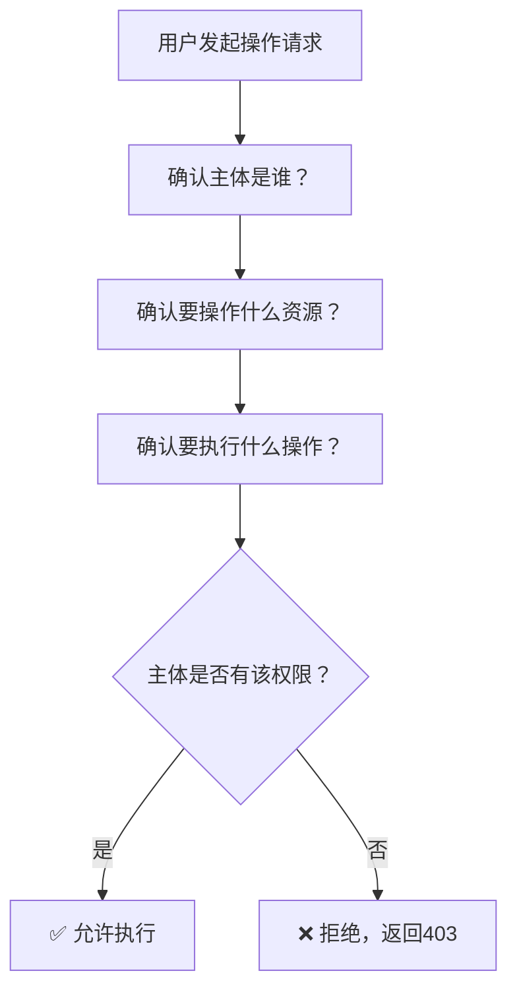

## 课程目标

- 理解没有权限控制的系统会面临哪些严重后果
- 掌握权限控制的三要素：主体、资源、操作
- 了解权限模型的演进路径和各个阶段的优劣
- 理解RBAC在整个权限模型体系中的定位
- 能够分析一个实际系统的权限需求

## 从场景和案例开始

### 想象一下这样的办公室

你入职了一家新公司。第一天上班，你走进办公楼，发现：

- **没有前台**——谁都能直接走进办公区
- **没有门禁**——你能推开任何一扇门，包括CEO办公室、财务室、机房
- **没有文件柜锁**——你能打开任何人的抽屉，看到所有文件
- **没有电脑密码**——你可以坐在任何一台电脑前，直接操作

你觉得这家公司怎么样？

- 第一反应：“管理也太混乱了吧！”
- 第二反应：“我的个人信息在这里安全吗？”
- 第三反应：“如果有坏人进来了怎么办？”

> [!NOTE]
> **在一个真实的商业系统中，缺乏权限控制，就相当于这样一家“没有锁”的公司。** 任何用户都可以访问任何数据、执行任何操作——这听起来很荒谬，但在很多开发初期的系统中，这恰恰是默认状态。

### 一个更真实的例子

你正在开发一个“企业文档管理系统”的MVP（最小可行产品）。为了快速上线，你们做了一个决定：**暂时不做权限控制，所有登录用户都能看到所有文档。**

上线后，发生了以下事情：

**事件一**：实习生小王登录系统，出于好奇点开了“公司薪酬结构表”，看到了所有员工的薪资数据。第二天，这条消息传遍了整个办公室。

**事件二**：产品经理在整理文档时，不小心点击了“批量删除”按钮，删除了部门半年的项目文档。因为没有“只能删除自己创建的文档”的限制，所有文档都消失了。

**事件三**：一位已经离职的员工，因为账号没有及时禁用，依然可以登录系统，下载了所有客户资料。

**事件四**：审计团队来检查系统安全，问：“你们如何控制不同角色的用户访问不同数据？”你们的回答是：“我们暂时还没做。”——审计不通过。

> [!IMPORTANT]
> **这些事故的根本原因只有一个：系统没有权限控制，不知道“谁”能“做什么”。** 任何人（包括不该看到的人）都能看到任何数据，任何人（包括不该操作的人）都能执行任何操作。

## 为什么权限控制是“非做不可”的？

### 四个无法回避的原因

| 原因         | 说明                          | 如果不做的后果               |
| ------------ | ----------------------------- | ---------------------------- |
| **数据安全** | 敏感数据只有特定角色才能查看  | 数据泄露、隐私侵权、法律诉讼 |
| **操作安全** | 危险操作只有授权人员才能执行  | 数据丢失、系统崩溃、业务中断 |
| **合规要求** | 等保、ISO 27001等法规强制要求 | 罚款、法律风险、失去客户信任 |
| **审计追溯** | 知道“谁在什么时间做了什么”    | 事故发生后无法定位责任人     |

### 数据安全：敏感数据不能人人可见

以下数据如果被不应该看到的人看到，会有什么后果？

| 数据类型                         | 后果示例                   | 真实案例                     |
| -------------------------------- | -------------------------- | ---------------------------- |
| 用户个人信息（姓名、电话、地址） | 隐私泄露，用户投诉         | Facebook 事件                |
| 财务数据（薪资、成本、利润）     | 商业机密泄露，竞争对手获利 | 某电商平台员工泄露价格策略   |
| 医疗记录                         | 法律诉讼，伦理争议         | 多家医院因信息泄露被处罚     |
| 知识产权（代码、设计稿）         | 核心技术外流               | 某科技公司员工下载源码后离职 |

> [!CAUTION]
> **数据安全的底线是“最小权限原则”（Principle of Least Privilege）**——每个人只能看到完成工作所必需的数据，不能多一分，也不能少一分。

### 操作安全：危险操作不能人人可做

有些操作本身是“危险的”，一旦误操作或恶意操作，后果不堪设想：

| 操作         | 后果示例         | 应该限制为       |
| ------------ | ---------------- | ---------------- |
| 删除数据库表 | 永久丢失所有数据 | 仅DBA可操作      |
| 批量删除文章 | 误删大量内容     | 仅管理员可操作   |
| 修改系统配置 | 可能导致系统崩溃 | 仅运维人员可操作 |
| 审核文章发布 | 不当内容被发布   | 仅审核员可操作   |
| 导出用户数据 | 数据批量泄露     | 仅特定角色可操作 |

> [!NOTE]
> **操作安全的核心是“责任到人”**——只有经过授权的责任人才能执行危险操作。一旦发生事故，可以追溯到具体的责任人。

### 合规要求：不只是“建议”，而是“强制”

近年来，各国纷纷出台了数据安全和隐私保护的法律法规：

| 法规          | 发布地区 | 核心要求         | 对权限控制的要求           |
| ------------- | -------- | ---------------- | -------------------------- |
| **GDPR**      | 欧盟     | 个人数据保护     | 必须控制谁可以访问个人数据 |
| **等保三级**  | 中国     | 网络安全等级保护 | 必须实现身份鉴别和访问控制 |
| **ISO 27001** | 国际     | 信息安全管理体系 | 必须有正式的访问控制策略   |

> [!WARNING]
> **合规不是选择题，是必答题。** 如果在合规审计中被发现没有权限控制，轻则整改，重则罚款——GDPR的最高罚款可达2000万欧元或全球年营业额的4%。

### 审计追溯：出了事，能找到人吗？

权限控制的另一个重要功能是**审计追溯**——记录谁在什么时间做了什么操作。

- **有权限控制 + 操作日志**：“张三在2024年1月15日14:23删除了文章ID=123”——清楚、准确、可追溯
- **无权限控制**：“不知道是谁删了这篇文章”——无法追溯、无法定责、无法改进

> [!TIP]
> **权限控制 + 操作日志 = 完整的审计能力。** 两者缺一不可。

## 权限控制的三要素

### 抽象思维：把复杂世界简化为三个概念

权限控制看似复杂——企业可能有成百上千的用户、数十种角色、数万份文档。但所有这些复杂性，都可以用三个核心概念来概括：

| 要素                  | 概念       | 通俗理解           | 技术对应                    |
| --------------------- | ---------- | ------------------ | --------------------------- |
| **主体（Subject）**   | 谁在操作？ | “我是谁？”         | 用户、角色、服务账号        |
| **资源（Resource）**  | 操作什么？ | “对什么东西操作？” | 数据表、文件、API、功能菜单 |
| **操作（Operation）** | 做什么？   | “我想干什么？”     | 增、删、改、查、导出、审核  |

### 如何组合使用三要素？

权限控制本质上就是一个“三元组判断”：

> **主体 对 资源 执行 操作 → 允许/拒绝**

用生活场景来理解：

| 场景                   | 主体         | 资源             | 操作 | 结论    |
| ---------------------- | ------------ | ---------------- | ---- | ------- |
| 你用自己的银行卡取钱   | 你（卡主）   | 你的银行卡账户   | 取款 | ✅ 允许 |
| 陌生人用你的银行卡取钱 | 陌生人       | 你的银行卡账户   | 取款 | ❌ 拒绝 |
| 你用同事的银行卡取钱   | 你（非卡主） | 同事的银行卡账户 | 取款 | ❌ 拒绝 |
| 管理员删除一篇文章     | 管理员       | 文章             | 删除 | ✅ 允许 |
| 普通用户删除别人的文章 | 普通用户     | 别人的文章       | 删除 | ❌ 拒绝 |

### 用技术术语来表述

| 概念                   | 含义                     | 示例                                 |
| ---------------------- | ------------------------ | ------------------------------------ |
| **主体（Subject）**    | 发起操作的人或系统       | `userId=1001`                        |
| **资源（Resource）**   | 被操作的对象             | `article:123`、`order:456`           |
| **操作（Operation）**  | 执行的动作               | `create`、`read`、`update`、`delete` |
| **权限（Permission）** | 对特定资源的特定操作     | `article:delete`                     |
| **角色（Role）**       | 一组权限的集合           | `admin`、`editor`、`viewer`          |
| **授权（Grant）**      | 允许某个主体执行某个操作 | 授予角色`admin`权限`article:delete`  |

### 一个简单的判断逻辑



## 权限模型的演进

> [!NOTE]
> 权限控制不是“一次性设计”的。随着系统从简单到复杂，权限模型也在不断演进。了解这个演进过程，可以帮助你理解“为什么RBAC是大多数企业级应用的选择”。

### 第一阶段：硬编码权限（“写在代码里”）

**特点**：权限判断直接写在业务代码中。

```java
// 硬编码权限判断
public void deleteArticle(Long articleId, Long userId) {
    // 写死在代码里
    if (userId == 1) {
        // 只有userId=1的超级用户可以删除
        articleRepository.delete(articleId);
    } else {
        throw new UnauthorizedException("无权限");
    }
}
```

**问题分析**：

| 问题           | 说明                                           |
| -------------- | ---------------------------------------------- |
| 改权限要改代码 | 每次权限调整都需要开发人员修改代码、编译、部署 |
| 权限分散在四处 | 同样的权限判断可能出现在多个地方，维护困难     |
| 无法动态调整   | 用户权限是写死的，无法在运行时变更             |
| 安全漏洞       | 很容易遗漏某个地方的权限判断                   |

**适用场景**：极小型系统（如个人博客）、一次性演示系统。

### 第二阶段：用户-权限直接关联（“我的权限列表”）

**特点**：每个用户有一个“权限列表”，系统检查用户是否有某个权限。

**数据结构**：

```sql
users: id, username
user_permissions: user_id, permission_name
```

**查询方式**：

```sql
-- 检查用户是否有删除文章的权限
SELECT 1 FROM user_permissions
WHERE user_id = 1001 AND permission_name = 'article:delete'
```

**问题分析**：

| 问题             | 说明                                                |
| ---------------- | --------------------------------------------------- |
| 配置工作量大     | 100个用户需要“文章管理”权限 → 要插入100条记录       |
| 权限变更困难     | 当“文章管理”的权限范围变化时，要更新100个用户的记录 |
| 难以理解权限结构 | 看不出“哪些人是一类角色”                            |

**适用场景**：用户数量很少的系统（如10人以内的内部工具）。

### 第三阶段：RBAC（用户-角色-权限）——我们最终的选择

**特点**：通过“角色”层来解耦用户和权限。

**数据模型**：

```
用户 ←→ 角色 ←→ 权限
```

**核心优势**：

- 用户和权限**通过角色解耦**，互不影响
- 一次配置角色权限，所有用户同步生效
- “批量管理”成为可能
- 权限结构直观易懂

**适用场景**：**大多数企业级应用**，用户数量从几十到几万不等。

### 第四阶段：ABAC（基于属性的访问控制）

**特点**：通过动态规则来判断权限，不依赖于固定的角色。

**示例**：

```
规则：用户可以查看“自己创建的”文章
规则：工作时间（9:00-18:00）可以访问系统
规则：IP在办公网段可以访问后台
```

**优势**：更加灵活，支持复杂的动态策略。

**劣势**：配置复杂，难以理解和维护，性能开销较大。

**适用场景**：复杂金融系统、银行系统、需要精细动态授权的场景。

### 四个阶段的对比总结

| 对比维度     | 硬编码      | 用户-权限直连       | RBAC              | ABAC     |
| ------------ | ----------- | ------------------- | ----------------- | -------- |
| **权限修改** | 改代码+部署 | 改数据库记录（N条） | 改角色配置（1条） | 改规则   |
| **批量管理** | ❌ 不可能   | ❌ 困难             | ✅ 容易           | ✅ 容易  |
| **权限结构** | 🔴 混乱     | 🟡 无层级           | 🟢 清晰           | 🟠 复杂  |
| **灵活度**   | 🔴 极低     | 🟡 中               | 🟢 高             | ⭐ 极高  |
| **理解成本** | 🟢 简单     | 🟢 简单             | 🟡 中等           | 🔴 高    |
| **适用规模** | 1-10人      | 10-50人             | **50-10万人**     | 特殊场景 |
| **推荐程度** | ❌ 不推荐   | ⚠️ 不推荐           | ✅ **强烈推荐**   | ⚠️ 按需  |

> [!IMPORTANT]
> **RBAC是“性价比最高”的权限模型。** 它在**理解成本、配置效率、扩展能力、维护难度**之间取得了最佳平衡。这就是为什么绝大多数企业级系统都选择RBAC。

## 为什么RBAC是“企业级应用的首选”？

### 从“人”的角度来看

在一个企业里，权限的本质是**岗位职责**：

- 财务部的人应该能看财务报表
- HR的人应该能看员工信息
- 技术部的人应该能看源代码和服务器配置
- 业务部的人应该能看客户数据和订单

> [!NOTE]
> **企业里的“岗位” → RBAC中的“角色”** 。把人按照“岗位”分组管理，这就是RBAC的天然合理性。RBAC之所以被广泛采用，核心原因就是它完美映射了企业组织结构的运作方式。

### 从“管理”的角度来看

| 场景         | 无RBAC                       | 有RBAC                 |
| ------------ | ---------------------------- | ---------------------- |
| 新员工入职   | 为员工逐个配置权限           | 为员工分配一个角色即可 |
| 员工岗位变动 | 找出该员工的所有权限逐一修改 | 更换角色即可           |
| 权限调整     | 修改每个相关用户的权限       | 修改角色定义即可       |
| 批量管理     | ❌ 无法批量操作              | ✅ 一次修改，全员生效  |
| 权限审计     | 逐个用户翻查，耗时数周       | 查角色列表，分钟级完成 |

### 从“安全”的角度来看

| 安全保障       | 说明                                                   |
| -------------- | ------------------------------------------------------ |
| **职责分离**   | 不同角色各司其职，互相制约（如：提交订单 vs 审核订单） |
| **最小权限**   | 每个角色只获得完成岗位任务所需的最小权限               |
| **权限可撤销** | 员工离职或转岗，移除其角色即可                         |
| **审计可追溯** | 通过“用户→角色→权限”链条可追溯授权路径                 |

### 一个真实的数字

如果系统有：

- 1000个用户
- 500种权限
- 10种角色

在RBAC中，权限配置只需要 **10条角色-权限关联** + **1000条用户-角色关联**。

而在“用户-权限直连”模式中，需要 **1000 × 平均权限数** 条关联——可能是数千甚至上万条。

> [!TIP]
> **有RBAC：10角色 × 权限 + 1000用户 = 约1010条配置**
> **无RBAC：1000用户 × 权限 = 上万条配置**
>
> RBAC的“角色层”把管理复杂度从 **O(用户 × 权限)** 降到了 **O(用户 + 角色 × 权限)** 。

## 本讲小结

本节课我们学习了：

1. **为什么需要权限控制**：
   - 数据安全：敏感数据不能人人可见
   - 操作安全：危险操作不能人人可做
   - 合规要求：法律法规强制要求
   - 审计追溯：出了事能找到人

2. **权限控制的三要素**：
   - 主体（谁）、资源（对什么）、操作（做什么）
   - 组合判断：主体对资源执行操作 → 允许/拒绝

3. **权限模型的演进**：
   - 硬编码 → 用户-权限直连 → **RBAC（推荐）** → ABAC
   - RBAC在理解成本、管理效率、扩展能力之间取得最佳平衡

4. **RBAC为什么是首选**：
   - 完美映射企业的“岗位→人”结构
   - 批量管理、一键生效
   - 从10人到10万人都能应对
