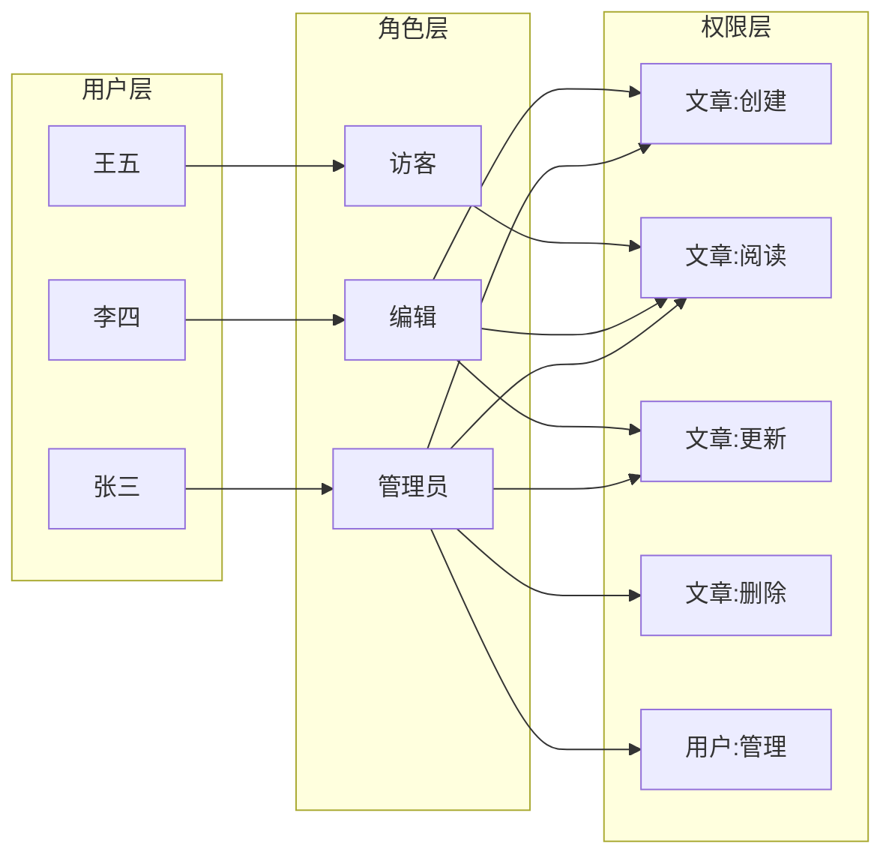
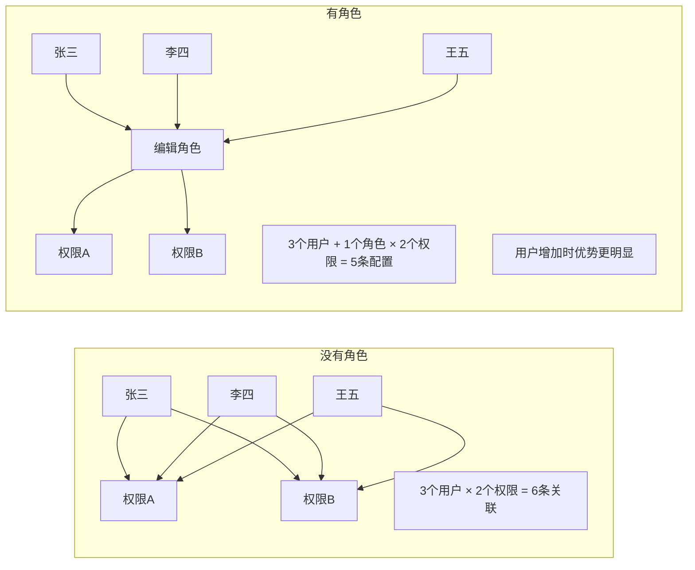
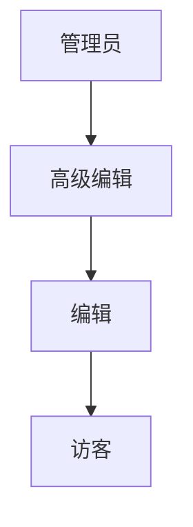
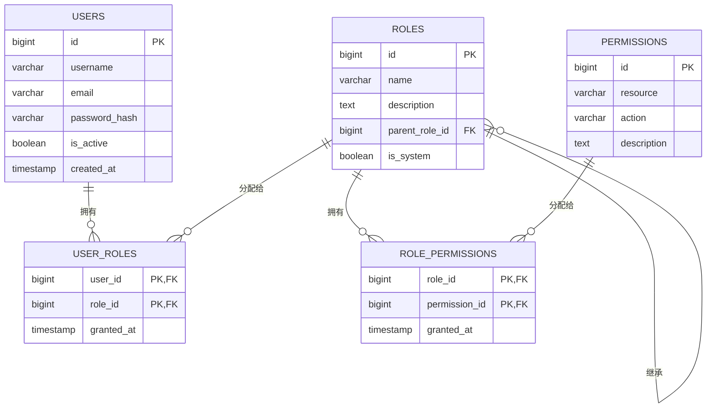

## 课程目标

- 掌握RBAC的三个核心实体：用户、角色、权限
- 深入理解“为什么需要角色层”这个核心设计动机
- 掌握角色继承（Role Hierarchy）的原理和应用场景
- 掌握权限命名的标准规范
- 能够为实际系统设计角色和权限的映射关系

## 回顾与引入：从“三要素”到“三实体”

在上节课中，我们学习了权限控制的三要素：

> **主体（谁）→ 资源（对什么）→ 操作（做什么）→ 允许/拒绝**

但“三要素”是一个**抽象概念框架**——它告诉我们权限控制“要判断什么”，但没有告诉我们“如何在系统中实现”。

> [!NOTE]
> **从“三要素”到“三实体”** ：三要素是“逻辑概念”，三实体是“物理实现”。三要素告诉我们“权限控制要判断什么”，三实体告诉我们“权限控制的底数据存在哪里、长什么样”。

在开始之前，请带着这个问题来学习本讲内容：

> **“如果用户的权限直接绑定在用户身上，而不经过‘角色’，会有什么问题？”**

这个问题看似简单，但它的答案就是RBAC存在的全部理由。如果这个问题没有答案，RBAC就只是一个“多余的设计”。如果这个问题有答案，RBAC就是“必要的架构”。

## RBAC的三个核心实体

### 全景图：先看整体

RBAC（基于角色的访问控制）的核心可以用一张图概括：



**从图中可以看出三条关键信息：**

1. **用户和角色是多对多关系**——一个用户可以有多个角色（张三既是“管理员”又是“编辑”）
2. **角色和权限是多对多关系**——一个角色可以有多个权限（“编辑”角色有“创建”“阅读”“更新”三个权限）
3. **用户不直接关联权限**——用户通过“角色”间接获得权限

> [!IMPORTANT]
> **“用户不直接关联权限”是RBAC最核心的设计原则。** 如果说OAuth2的核心是“用令牌代替密码”，那么RBAC的核心就是“用角色连接用户和权限”。

### 实体一：用户（User）

**定义**：系统中的操作主体，通常是“人”，也可以是“服务账号”或“系统账号”。

**通俗理解**：用户就是“谁”——张三、李四、王五，以及你开发的应用本身（当应用作为服务调用其他API时）。

**用户的常见类型**：

| 用户类型       | 说明                 | 示例                        |
| -------------- | -------------------- | --------------------------- |
| **自然人用户** | 真实的人使用系统     | 员工、客户、合作伙伴        |
| **服务账号**   | 系统或应用之间的通信 | 微服务A调用微服务B的API     |
| **管理员账号** | 拥有特殊权限的用户   | 系统管理员、运维人员        |
| **外部用户**   | 非本组织的用户       | 供应商、外包人员、API消费者 |

**用户的核心属性**：

| 属性         | 说明     | 示例                           |
| ------------ | -------- | ------------------------------ |
| **用户ID**   | 唯一标识 | `user_1001`                    |
| **用户名**   | 登录凭证 | `zhangsan`                     |
| **邮箱**     | 联系信息 | `zhangsan@company.com`         |
| **密码哈希** | 认证凭证 | `$2a$10$...`（加密存储）       |
| **状态**     | 是否可用 | `active`、`inactive`、`locked` |
| **创建时间** | 审计追踪 | `2024-01-15 10:30:00`          |

> [!TIP]
> 在RBAC中，用户唯一的功能就是“拥有角色”。用户本身不直接拥有权限。这就像一个人不直接拥有“进入某房间”的权利，而是通过“持有某张门禁卡”来获得这个权利。

### 实体二：角色（Role）

**定义**：一组权限的集合，代表系统中的一个“岗位”或“身份”。

**通俗理解**：角色就是“岗位”——管理员、编辑、访客、财务主管、人事专员。在公司里，一个人可以身兼多职（既是“项目经理”又是“技术负责人”），在RBAC中，一个用户也可以被分配多个角色。

**角色的重要作用**：

> [!IMPORTANT]
> **角色是RBAC的核心枢纽。** 它让“用户”和“权限”不再直接绑定，实现了两者的解耦。



**角色的设计原则**：

| 原则         | 说明                                                         | 示例                                                                     |
| ------------ | ------------------------------------------------------------ | ------------------------------------------------------------------------ |
| **命名清晰** | 角色名称应直观反映其职责                                     | ✅ `article_editor`、❌ `role_001`                                       |
| **粒度适中** | 既不要太粗（一个角色管所有），也不要太细（每个权限一个角色） | ✅ `content_manager`（内容管理）、❌ `文章创建_修改_删除_审核_发布_归档` |
| **职责单一** | 每个角色对应一个明确的“岗位职责”                             | ✅ 不要混淆“系统管理员”和“内容管理员”                                    |
| **可扩展**   | 预留未来扩展空间，但不过度设计                               | ✅ 先设计3-5个核心角色，按需增加                                         |

### 实体三：权限（Permission）

**定义**：对某个“资源”执行某个“操作”的许可。

**通俗理解**：权限就是“能做什么”——“能否创建文章”、“能否删除用户”、“能否导出数据”。

**权限的结构化表达**：

权限 = `{resource}:{action}`

| 组成部分             | 含义               | 示例                                  |
| -------------------- | ------------------ | ------------------------------------- |
| **资源（Resource）** | 操作的对象是什么？ | `article`、`user`、`order`、`comment` |
| **操作（Action）**   | 对这个对象做什么？ | `create`、`read`、`update`、`delete`  |

**完整的权限示例**：

| 权限标识           | 含义         | 读法                     |
| ------------------ | ------------ | ------------------------ |
| `article:create`   | 创建文章     | “对文章资源执行创建操作” |
| `article:read`     | 阅读文章     | “对文章资源执行阅读操作” |
| `article:update`   | 更新文章     | “对文章资源执行更新操作” |
| `article:delete`   | 删除文章     | “对文章资源执行删除操作” |
| `user:read`        | 查看用户信息 | “对用户资源执行阅读操作” |
| `user:delete`      | 删除用户     | “对用户资源执行删除操作” |
| `order:export`     | 导出订单     | “对订单资源执行导出操作” |
| `comment:moderate` | 审核评论     | “对评论资源执行审核操作” |

> [!TIP]
> **权限命名的艺术**：好的权限命名就像一门精简的语言——`资源:操作`的格式让任何人都能一眼看懂“这是什么资源的什么操作”。相比之下，`perm_001`、`can_delete_articles`、`ARTICLE_DELETE_PERMISSION` 等命名方式要么不直观，要么不统一。统一的命名规范是权限系统可维护性的基础。

## 核心设计动机：为什么需要“角色”这一层？

### 如果没有角色层会怎样？

想象一个简单的博客系统，有3个作者和1个管理员。

**没有角色层（用户-权限直连）** ：

```
张三 (author) → 权限: article:create, article:read, article:update, article:delete
李四 (author) → 权限: article:create, article:read, article:update, article:delete
王五 (author) → 权限: article:create, article:read, article:update, article:delete
赵六 (admin)  → 权限: article:create, article:read, article:update, article:delete, user:manage
```

**问题来了**：

| 场景                             | 没有角色层，你会怎么做？                              |
| -------------------------------- | ----------------------------------------------------- |
| 新增一个作者（钱七）             | 为钱七手动配置4条权限（create、read、update、delete） |
| 新增一个权限（article:publish）  | 为现有3个作者 + 未来所有作者，每人单独配置这个权限    |
| 作者权限调整（不能再删除文章了） | 修改张三、李四、王五…三个人的配置                     |
| 管理员：赵六离职，孙七接替       | 把赵六的权限列表完整复制给孙七（4+1条）               |

如果系统有**100个作者**，每次权限调整都要修改100个人的配置——这不是“工作量大小”的问题，而是“这样的系统根本无法维护”。

> [!CAUTION]
> **没有角色的系统，权限管理复杂度随用户数量线性增长。** 用户越多，管理越混乱，最终系统会变成一团乱麻——没人敢改权限，因为不知道会影响到谁。

### 有了角色层之后

**有角色层（RBAC）** ：

```
角色: author → 权限: article:create, article:read, article:update, article:delete
角色: admin  → 权限: article:create, article:read, article:update, article:delete, user:manage

张三 → author
李四 → author
王五 → author
赵六 → admin
```

**同样的场景，现在怎么做？**

| 场景                             | 有角色层，你会怎么做？                                              |
| -------------------------------- | ------------------------------------------------------------------- |
| 新增一个作者（钱七）             | 把 `author` 角色分配给钱七 → 1步操作                                |
| 新增一个权限（article:publish）  | 把 `article:publish` 加到 `author` 角色 → 1步操作，所有作者自动获得 |
| 作者权限调整（不能再删除文章了） | 从 `author` 角色中移除 `article:delete` → 1步操作，所有作者同步变更 |
| 管理员：赵六离职，孙七接替       | 把 `admin` 角色分配给孙七 → 1步操作                                 |

> [!IMPORTANT]
> **角色层的核心价值：一次配置，全员生效；批量管理，精准控制。** 它将权限管理从“逐个用户配置”变成了“按角色批量配置”，将O(N)的复杂度降到了O(1)。

### 数据层面的对比

我们来算一笔账：**一个中等规模的系统，角色层能节省多少配置？**

| 场景                 | 无RBAC（用户-权限直连）                      | 有RBAC                                                     |
| -------------------- | -------------------------------------------- | ---------------------------------------------------------- |
| 用户数               | 1000人                                       | 1000人                                                     |
| 权限数               | 50种                                         | 50种                                                       |
| 角色数               | 0种                                          | 10种                                                       |
| 关联数               | 1000 × 平均权限数（约10条/人）= **10,000条** | 1000个用户-角色关联 + 10 × 50条角色-权限关联 = **1,500条** |
| 配置量               | 10,000条                                     | 1,500条（**减少85%** ）                                    |
| 一次权限调整的工作量 | 修改X个用户的配置                            | 修改1个角色的配置                                          |

> [!TIP]
> **RBAC把权限管理从“为人配权”变成了“为岗位配权”。** 人变岗位不变 → 无需动权限，只需动用户-角色关联。岗位职责变化 → 只需修改角色定义，所有在岗人员自动同步。

## 角色继承（Role Hierarchy）

### 什么是角色继承？

角色继承是指**一个角色可以拥有另一个角色的所有权限**——高级角色自动包含低级角色的全部权限。



**读法**：箭头从高级角色指向低级角色，表示“高级角色继承低级角色的所有权限”。

| 角色     | 自己的特有权限                     | 从下级继承的权限      | 总计 |
| -------- | ---------------------------------- | --------------------- | ---- |
| 访客     | `article:read`                     | -                     | 1条  |
| 编辑     | `article:create`、`article:update` | `article:read`        | 3条  |
| 高级编辑 | `article:publish`                  | 编辑的2条 + 访客的1条 | 4条  |
| 管理员   | `user:manage`、`article:delete`    | 高级编辑的4条         | 6条  |

### 为什么需要角色继承？

**场景一：权限的层级管理**

一个内容管理系统中，权限天然就有层级：

- “只能看”（访客）
- “能看 + 能写”（编辑）
- “能看 + 能写 + 能审核发布”（高级编辑）
- “什么都能做”（管理员）

如果不用角色继承，就需要为每个角色**重复配置**所有权限——这违反了DRY（Don‘t Repeat Yourself）原则。

**场景二：组织结构映射**

企业的组织架构天然是树形的：

```
公司
├── 管理层（继承所有人的权限）
├── 部门经理（继承本部门所有人的权限）
│   ├── 高级工程师（继承普通工程师的权限）
│   └── 普通工程师
└── 实习员工（只读权限）
```

> [!NOTE]
> 角色继承让RBAC的权限模型**从“平面”变成了“立体”** 。没有继承的角色是“扁平的”，有了继承的角色是“有层级的”——就像公司组织架构图一样。

### 角色继承的两种实现方式

| 实现方式           | 说明                                                                     | 优点                 | 缺点                       |
| ------------------ | ------------------------------------------------------------------------ | -------------------- | -------------------------- |
| **硬编码继承**     | 在代码中写死角色关系（如 `if role == “admin”， return all permissions`） | 简单直接             | 不灵活，改角色继承要改代码 |
| **数据库驱动继承** | 使用 `parent_role_id` 字段，运行时动态查询                               | 灵活，可在运行时调整 | 实现稍复杂，需要递归查询   |

**数据库驱动继承的查询逻辑**：

```sql
// 输入：用户ID = 1001
// 输出：该用户拥有的所有权限（资源 + 操作）

// 1. 获取用户直接分配的角色
directRoles = SELECT role_id FROM user_roles WHERE user_id = 1001

// 2. 递归获取所有父角色（角色继承链）
allRoles = directRoles  // 初始化为直接角色
for each role in directRoles:
    // 沿 parent_role_id 不断向上查找，直到没有父角色
    current = role
    while current.parent_role_id IS NOT NULL:
        current = SELECT * FROM roles WHERE id = current.parent_role_id
        allRoles.add(current.id)

// 3. 查询所有相关角色拥有的权限
permissions = SELECT resource, action FROM permissions
              JOIN role_permissions ON role_permissions.permission_id = permissions.id
              WHERE role_permissions.role_id IN (allRoles)

// 4. 返回权限列表
return permissions
```

### 角色继承的注意事项

| 注意事项         | 说明                                           |
| ---------------- | ---------------------------------------------- |
| **避免循环继承** | A继承B，B继承C，C不能继承A（会造成无限递归）   |
| **权限爆炸**     | 顶层角色的权限量可能非常大，注意查询性能       |
| **职责清晰**     | 角色继承应反映“职责范围扩大”，而不是“权限叠加” |
| **审计友好**     | 继承链越深，越难理解“这个用户为什么有这个权限” |

## 权限的命名规范

### 为什么需要命名规范？

一个系统的权限列表可能有几十甚至几百条。如果命名没有规范，维护将是一场灾难：

| ❌ 不规范的命名             | ✅ 规范的命名    |
| --------------------------- | ---------------- |
| `can_delete_articles`       | `article:delete` |
| `DELETE_ARTICLES`           | `article:delete` |
| `perm_article_delete`       | `article:delete` |
| `article_delete_permission` | `article:delete` |
| `delete_article_perm`       | `article:delete` |

> [!TIP]
> **统一规范 > 各自为政。** 规范化的命名让人一眼就能看懂、能预测、能记忆，降低了整个团队的理解成本。

### 标准格式：`{resource}:{action}`

**资源（Resource）** ：操作的对象

| 资源名    | 含义     | 示例               |
| --------- | -------- | ------------------ |
| `article` | 文章     | `article:create`   |
| `user`    | 用户     | `user:read`        |
| `order`   | 订单     | `order:export`     |
| `comment` | 评论     | `comment:delete`   |
| `system`  | 系统配置 | `system:configure` |
| `report`  | 报表     | `report:generate`  |

**操作（Action）** ：对资源执行的动作

| 操作名    | 含义         | 使用场景        |
| --------- | ------------ | --------------- |
| `create`  | 创建新资源   | POST请求        |
| `read`    | 读取资源     | GET请求         |
| `update`  | 完整更新资源 | PUT请求         |
| `delete`  | 删除资源     | DELETE请求      |
| `patch`   | 部分更新资源 | PATCH请求       |
| `list`    | 列出资源     | GET（列表）请求 |
| `export`  | 导出数据     | 下载功能        |
| `import`  | 导入数据     | 批量上传        |
| `approve` | 审核通过     | 审批流程        |
| `reject`  | 审核拒绝     | 审批流程        |
| `publish` | 发布         | 内容发布流程    |

### 扩展示例

| 权限                  | 含义         | 所属模块 |
| --------------------- | ------------ | -------- |
| `article:create`      | 创建文章     | 内容管理 |
| `article:read`        | 阅读文章     | 内容管理 |
| `article:update`      | 更新文章     | 内容管理 |
| `article:delete`      | 删除文章     | 内容管理 |
| `article:publish`     | 发布文章     | 内容管理 |
| `article:archive`     | 归档文章     | 内容管理 |
| `user:read`           | 查看用户信息 | 用户管理 |
| `user:update`         | 更新用户信息 | 用户管理 |
| `user:delete`         | 删除用户     | 用户管理 |
| `user:reset_password` | 重置用户密码 | 用户管理 |
| `order:read`          | 查看订单     | 订单管理 |
| `order:export`        | 导出订单数据 | 订单管理 |
| `order:cancel`        | 取消订单     | 订单管理 |
| `comment:delete`      | 删除评论     | 评论管理 |
| `comment:moderate`    | 审核评论     | 评论管理 |
| `system:configure`    | 系统配置     | 系统管理 |

### 进阶命名：支持资源实例级别权限

对于更细粒度的权限控制，可以在 `resource` 部分包含“实例标识”：

| 权限                      | 含义              | 说明               |
| ------------------------- | ----------------- | ------------------ |
| `article:123:update`      | 更新ID为123的文章 | 特定文章的更新权限 |
| `department:finance:read` | 读取财务部的数据  | 部门级别的数据隔离 |

> [!NOTE]
> 资源实例级别的权限属于**更高级的权限模型**（如ABAC的雏形）。在标准的RBAC中，权限一般是“类型级别”的（如“能不能创建文章”），而不是“实例级别”的（如“能不能创建ID为123的这篇文章”）。

## 完整模型图

### RBAC核心ER图



### 一个完整的配置示例

**角色定义**：

| 角色名          | 描述                 | 父角色          |
| --------------- | -------------------- | --------------- |
| `visitor`       | 访客，只能阅读文章   | 无              |
| `editor`        | 编辑，可写文章       | `visitor`       |
| `senior_editor` | 高级编辑，可审核发布 | `editor`        |
| `admin`         | 管理员，可管理用户   | `senior_editor` |

**权限定义**：

| 权限              | 分配给哪些角色                                |
| ----------------- | --------------------------------------------- |
| `article:read`    | `visitor`、`editor`、`senior_editor`、`admin` |
| `article:create`  | `editor`、`senior_editor`、`admin`            |
| `article:update`  | `editor`、`senior_editor`、`admin`            |
| `article:delete`  | `admin`                                       |
| `article:publish` | `senior_editor`、`admin`                      |
| `user:manage`     | `admin`                                       |

## 本讲小结

本节课我们学习了：

1. **RBAC的三个核心实体**：
   - 用户（User）：操作的主体
   - 角色（Role）：权限的集合，核心枢纽
   - 权限（Permission）：对特定资源的特定操作

2. **为什么需要角色层**：
   - 解耦用户和权限，实现“一次配置，全员生效”
   - 将权限管理从O(N)降到O(1)
   - 完美映射企业的“岗位→人”组织结构

3. **角色继承（Role Hierarchy）** ：
   - 高级角色自动拥有低级角色的所有权限
   - 用 `parent_role_id` 实现灵活的层级关系
   - 避免权限的重复定义

4. **权限命名规范**：
   - 标准格式：`{resource}:{action}`
   - 示例：`article:create`、`user:delete`
   - 统一规范降低理解成本
