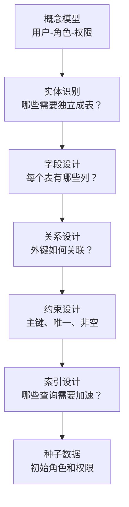
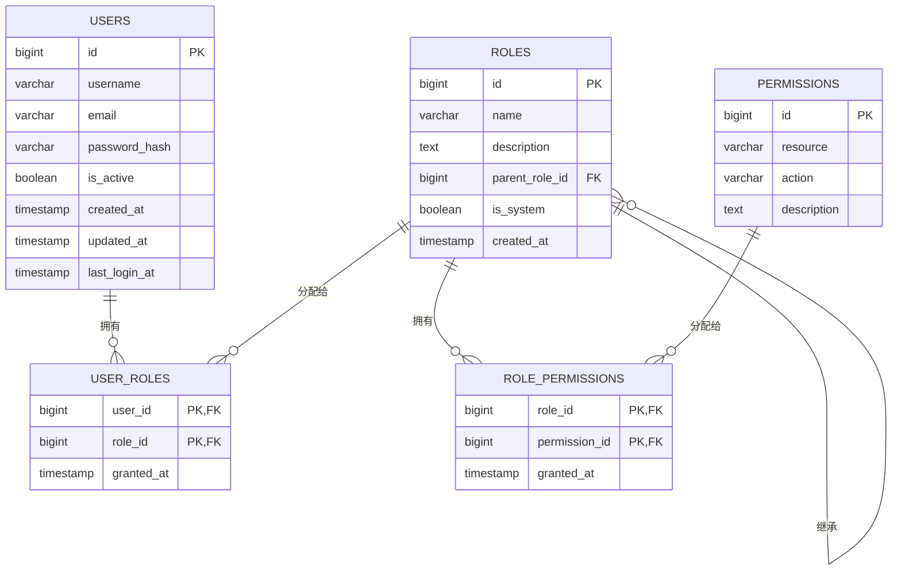
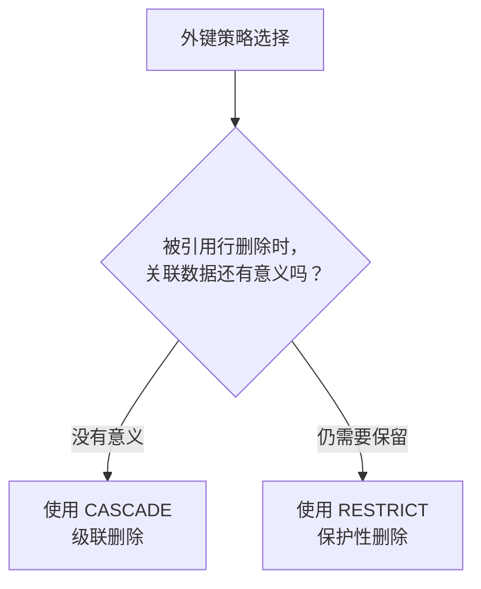

## 课程目标

- 理解从“概念模型”到“物理模型”的转化过程
- 掌握RBAC五张表的完整DDL设计
- 理解每张表的外键策略、索引设计和字段含义
- 掌握角色继承在数据库层面的实现方式
- 能够在PostgreSQL中独立执行建表语句并插入初始数据

## 回顾与引入：从概念到物理

在上一讲中，我们设计了RBAC的“概念模型”：


我们有三个实体（用户、角色、权限）和两种关系（用户-角色、角色-权限）。现在的问题是：

> **“这些方框和箭头，怎么变成数据库里的表和字段？”**

这就是本讲要解决的问题——**从“概念模型”到“物理模型”的转化**。本讲的知识地图：



## 整体设计：五张表的全景图

### 为什么要五张表？——两张关联表的价值

先看一个简单的误区：

> **“三个实体不就是三张表吗？为什么需要五张？”**

问得好。如果只有三张表（users、roles、permissions），那么“张三有管理员角色”和“管理员有删除文章的权限”这两个关系就无处存放。

我们需要**两张关联表**来存储这两种多对多关系：

| 表名               | 作用             | 关系       |
| ------------------ | ---------------- | ---------- |
| `users`            | 存储用户信息     | 主表       |
| `roles`            | 存储角色信息     | 主表       |
| `permissions`      | 存储权限信息     | 主表       |
| `user_roles`       | 用户和角色的关联 | **关联表** |
| `role_permissions` | 角色和权限的关联 | **关联表** |

> [!IMPORTANT]
> **两张关联表是RBAC数据库设计的灵魂。** 它们本身不存储“业务数据”，却定义了整个权限系统的骨架——谁有什么角色，角色有什么权限。

### 五张表的ER图



### 一个故事帮你理解五张表的关系

让我们用一个完整的故事来说明：

张三（**users表**）入职公司，被分配了“内容编辑”这个岗位（**roles表**中的`editor`角色）。这个信息存储在**user_roles表**中——记录着“张三”和“内容编辑”之间的关联。

“内容编辑”这个岗位的职责是：“创建文章、编辑文章、阅读文章”（**permissions表**中的`article:create`、`article:update`、`article:read`）。这些职责存储在**role_permissions表**中——记录着“内容编辑”和这些权限之间的关联。

当张三登录系统，想创建一篇文章时：

1. 系统查出张三是谁 → 查到他的用户ID
2. 去`user_roles`表查出张三有哪些角色 → 查到“内容编辑”
3. 去`role_permissions`表查出“内容编辑”有哪些权限 → 查到`article:create`
4. 判断：`article:create`是否在权限列表中？是 → 允许创建

> [!TIP]
> 这就是RBAC数据库的“查询链条”——从用户到角色到权限，一条完整的链路。这条链路就是权限判断的数据基础。

## 第一张表：users（用户表）

用户是权限系统的“主体”——所有权限判断的起点都是“谁在操作”。没有用户表，系统不知道“张三是谁”，也就无法判断他有什么权限。

### 完整DDL

```sql
-- 1. 用户表
CREATE TABLE users (
    id BIGSERIAL PRIMARY KEY,
    username VARCHAR(50) UNIQUE NOT NULL,
    email VARCHAR(100) UNIQUE NOT NULL,
    password_hash VARCHAR(255) NOT NULL,
    is_active BOOLEAN DEFAULT TRUE,
    created_at TIMESTAMPTZ DEFAULT CURRENT_TIMESTAMP,
    updated_at TIMESTAMPTZ DEFAULT CURRENT_TIMESTAMP,
    last_login_at TIMESTAMPTZ
);

-- 索引
CREATE INDEX idx_users_username ON users(username);
CREATE INDEX idx_users_email ON users(email);
CREATE INDEX idx_users_is_active ON users(is_active);
```

### 字段逐一解析

| 字段            | 类型           | 说明             | 为什么这样设计？                                                     |
| --------------- | -------------- | ---------------- | -------------------------------------------------------------------- |
| `id`            | `BIGSERIAL`    | 主键，自增ID     | 每行数据的唯一标识，关联其他表时用这个ID                             |
| `username`      | `VARCHAR(50)`  | 登录用户名，唯一 | 用户登录凭证；唯一约束防止重名                                       |
| `email`         | `VARCHAR(100)` | 邮箱，唯一       | 用于联系和找回密码；唯一约束防止同一邮箱重复注册                     |
| `password_hash` | `VARCHAR(255)` | 密码哈希值       | **绝对不存明文密码！** 255长度够容纳各种哈希算法（BCrypt、PBKDF2等） |
| `is_active`     | `BOOLEAN`      | 账号是否可用     | 软删除/账号禁用：保留数据但禁止登录                                  |
| `created_at`    | `TIMESTAMPTZ`  | 创建时间         | 审计追踪：知道账号什么时候创建的                                     |
| `updated_at`    | `TIMESTAMPTZ`  | 更新时间         | 审计追踪：知道信息最后一次修改时间                                   |
| `last_login_at` | `TIMESTAMPTZ`  | 最后登录时间     | 安全审计：异常登录检测                                               |

> [!WARNING]
> **password_hash字段绝对不存明文密码！** 这是安全底线。应该使用BCrypt、Argon2等强哈希算法，配合盐值（Salt）存储。如果数据库被攻破，攻击者拿到的是哈希值，而不是原始密码。

### 为什么使用`BIGSERIAL`而不是`UUID`？

| 对比       | `BIGSERIAL`（自增整数） | `UUID`（通用唯一标识符）                       |
| ---------- | ----------------------- | ---------------------------------------------- |
| 存储大小   | 8字节                   | 16字节                                         |
| 索引效率   | 高（整数比较快）        | 低（字符串比较慢）                             |
| 可读性     | 高（如`1`、`2`、`3`）   | 低（如`550e8400-e29b-41d4-a716-446655440000`） |
| 分布式系统 | 不适用（中心化生成）    | 适用（无需中心协调）                           |
| 暴露风险   | 可预测（易猜出ID）      | 不可预测（安全）                               |

> [!NOTE]
> 对于大多数企业级应用，`BIGSERIAL`是更好的选择——性能更好、更直观、索引更快。如果你的系统是分布式微服务架构，可以考虑`UUID`。但在学习阶段，`BIGSERIAL`更简单。

## 第二张表：roles（角色表）

角色是RBAC的核心枢纽——它连接用户和权限。没有角色表，“用户-权限”就无法解耦。

### 完整DDL

```sql
-- 2. 角色表
CREATE TABLE roles (
    id BIGSERIAL PRIMARY KEY,
    name VARCHAR(50) UNIQUE NOT NULL,
    description TEXT,
    parent_role_id BIGINT REFERENCES roles(id) ON DELETE RESTRICT,
    is_system BOOLEAN DEFAULT FALSE,
    created_at TIMESTAMPTZ DEFAULT CURRENT_TIMESTAMP
);

-- 索引
CREATE INDEX idx_roles_name ON roles(name);
CREATE INDEX idx_roles_parent_role_id ON roles(parent_role_id);
```

### 字段逐一解析

| 字段             | 类型          | 说明                   | 为什么这样设计？                                           |
| ---------------- | ------------- | ---------------------- | ---------------------------------------------------------- |
| `id`             | `BIGSERIAL`   | 主键                   | 角色的唯一标识                                             |
| `name`           | `VARCHAR(50)` | 角色名称，唯一         | 如`admin`、`editor`、`viewer`；唯一约束防止重复            |
| `description`    | `TEXT`        | 角色描述               | 让人看懂这个角色是干什么的，如“内容编辑，可创建和编辑文章” |
| `parent_role_id` | `BIGINT`      | 父角色ID（自引用外键） | 实现角色继承。指向`roles`表的`id`字段                      |
| `is_system`      | `BOOLEAN`     | 是否系统内置角色       | 防止误删内置角色（如`admin`）                              |
| `created_at`     | `TIMESTAMPTZ` | 创建时间               | 审计追踪                                                   |

### 角色继承的实现：`parent_role_id`

`parent_role_id`是一个**自引用外键**——它引用的是本表（`roles`表）的`id`字段。

```sql
-- 自引用外键的定义
parent_role_id BIGINT REFERENCES roles(id) ON DELETE RESTRICT
```

**数据示例**：

```sql
-- 插入带有继承关系的角色数据
INSERT INTO roles (name, description, parent_role_id) VALUES
('visitor', '访客，只能阅读文章', NULL),
('editor', '编辑，可创建和编辑文章', 1),   -- 继承visitor
('senior_editor', '高级编辑，可审核发布', 2),  -- 继承editor
('admin', '管理员，可管理一切', 3);        -- 继承senior_editor
```

**查询结果**：

| id  | name          | parent_role_id |
| --- | ------------- | -------------- |
| 1   | visitor       | NULL           |
| 2   | editor        | 1              |
| 3   | senior_editor | 2              |
| 4   | admin         | 3              |

**继承链**：`admin` → `senior_editor` → `editor` → `visitor`

> [!TIP]
> `parent_role_id`实现了“无限级角色继承”——理论上你可以建立任意层级的继承关系。但在实际设计中，2-3层通常就足够了（如“员工→经理→总监”）。

### `ON DELETE RESTRICT`是什么？

`ON DELETE RESTRICT`的意思是：**如果有人试图删除一个角色，而这个角色被其他行引用（作为父角色），PostgreSQL会拒绝删除操作。**

```sql
-- 尝试删除被引用的角色
DELETE FROM roles WHERE id = 1;  -- 这个角色是editor的父角色
-- 结果：ERROR: update or delete on table "roles" violates foreign key constraint
```

> [!NOTE]
> **为什么不用`ON DELETE CASCADE`？** 如果删除`visitor`角色，使用`CASCADE`会导致所有子角色（`editor`、`senior_editor`、`admin`）也被级联删除——这通常不是我们想要的行为。`RESTRICT`让我们必须显式处理继承关系，避免误删。

## 第三张表：permissions（权限表）

权限是权限控制的“原子单位”——最小粒度的控制单元。每个权限都代表“对某个资源的某种操作”。

### 完整DDL

```sql
-- 3. 权限表
CREATE TABLE permissions (
    id BIGSERIAL PRIMARY KEY,
    resource VARCHAR(100) NOT NULL,
    action VARCHAR(50) NOT NULL,
    description TEXT,
    UNIQUE(resource, action)  -- 复合唯一约束
);

-- 索引
CREATE INDEX idx_permissions_resource ON permissions(resource);
CREATE INDEX idx_permissions_action ON permissions(action);
```

### 字段逐一解析

| 字段          | 类型           | 说明     | 为什么这样设计？                       |
| ------------- | -------------- | -------- | -------------------------------------- |
| `id`          | `BIGSERIAL`    | 主键     | 权限的唯一标识                         |
| `resource`    | `VARCHAR(100)` | 资源名称 | 如`article`、`user`、`order`           |
| `action`      | `VARCHAR(50)`  | 操作名称 | 如`create`、`read`、`update`、`delete` |
| `description` | `TEXT`         | 权限描述 | 让人看懂这个权限是干什么的             |

### 复合唯一约束：`UNIQUE(resource, action)`

```sql
UNIQUE(resource, action)  -- 复合唯一约束
```

这个约束保证了**同一个资源+操作组合只能出现一次**。

```sql
-- ✅ 可以插入
INSERT INTO permissions (resource, action) VALUES ('article', 'create');
INSERT INTO permissions (resource, action) VALUES ('article', 'read');

-- ❌ 重复，会报错
INSERT INTO permissions (resource, action) VALUES ('article', 'create');
-- 结果：ERROR: duplicate key value violates unique constraint
```

> [!TIP]
> 复合唯一约束确保了权限数据的整洁——不会出现两个相同的`article:create`。如果权限数据出现重复，查询和分配都会出现混乱。

## 第四张表：user_roles（用户-角色关联表）

用户和角色是**多对多关系**——一个用户可以有多个角色，一个角色可以分配给多个用户。两张主表（users和roles）无法直接表达这种关系，需要一张“中间表”来记录。

### 完整DDL

```sql
-- 4. 用户-角色关联表
CREATE TABLE user_roles (
    user_id BIGINT REFERENCES users(id) ON DELETE CASCADE,
    role_id BIGINT REFERENCES roles(id) ON DELETE CASCADE,
    granted_at TIMESTAMPTZ DEFAULT CURRENT_TIMESTAMP,
    PRIMARY KEY (user_id, role_id)
);

-- 索引
CREATE INDEX idx_user_roles_user_id ON user_roles(user_id);
CREATE INDEX idx_user_roles_role_id ON user_roles(role_id);
```

### 字段逐一解析

| 字段         | 类型          | 说明           | 为什么这样设计？             |
| ------------ | ------------- | -------------- | ---------------------------- |
| `user_id`    | `BIGINT`      | 用户ID（外键） | 指向`users`表，关联用户      |
| `role_id`    | `BIGINT`      | 角色ID（外键） | 指向`roles`表，关联角色      |
| `granted_at` | `TIMESTAMPTZ` | 授权时间       | 审计追踪：知道什么时候分配的 |

### 复合主键：`PRIMARY KEY (user_id, role_id)`

```sql
PRIMARY KEY (user_id, role_id)
```

这意味着：(user_id, role_id)的组合是唯一的——**同一个用户不会被重复分配同一个角色**。

```sql
-- ✅ 可以插入
INSERT INTO user_roles (user_id, role_id) VALUES (1, 2);

-- ❌ 重复分配，会报错
INSERT INTO user_roles (user_id, role_id) VALUES (1, 2);
-- 结果：ERROR: duplicate key value violates unique constraint
```

### `ON DELETE CASCADE`——级联删除

```sql
user_id BIGINT REFERENCES users(id) ON DELETE CASCADE,
role_id BIGINT REFERENCES roles(id) ON DELETE CASCADE
```

**含义**：

| 情况                  | 行为                                           |
| --------------------- | ---------------------------------------------- |
| 删除`users`表中的用户 | `user_roles`中所有关联该用户的记录**自动删除** |
| 删除`roles`表中的角色 | `user_roles`中所有关联该角色的记录**自动删除** |

> [!TIP]
> **为什么用`CASCADE`？** 当用户被删除时，他“不再拥有任何角色”——这是符合逻辑的。如果不用`CASCADE`，删除用户时还需要手动清理`user_roles`表，增加开发负担。

## 第五张表：role_permissions（角色-权限关联表）

角色和权限也是**多对多关系**——一个角色可以有多个权限，一个权限可以分配给多个角色。同样需要“中间表”来记录。

### 完整DDL

```sql
-- 5. 角色-权限关联表
CREATE TABLE role_permissions (
    role_id BIGINT REFERENCES roles(id) ON DELETE CASCADE,
    permission_id BIGINT REFERENCES permissions(id) ON DELETE CASCADE,
    granted_at TIMESTAMPTZ DEFAULT CURRENT_TIMESTAMP,
    PRIMARY KEY (role_id, permission_id)
);

-- 索引
CREATE INDEX idx_role_permissions_role_id ON role_permissions(role_id);
CREATE INDEX idx_role_permissions_permission_id ON role_permissions(permission_id);
```

### 字段逐一解析

| 字段            | 类型          | 说明           | 为什么这样设计？              |
| --------------- | ------------- | -------------- | ----------------------------- |
| `role_id`       | `BIGINT`      | 角色ID（外键） | 指向`roles`表，关联角色       |
| `permission_id` | `BIGINT`      | 权限ID（外键） | 指向`permissions`表，关联权限 |
| `granted_at`    | `TIMESTAMPTZ` | 授权时间       | 审计追踪                      |

### 与`user_roles`的对称设计

| 对比       | `user_roles`                  | `role_permissions`            |
| ---------- | ----------------------------- | ----------------------------- |
| 关联的两端 | 用户 ↔ 角色                   | 角色 ↔ 权限                   |
| 外键       | `user_id`、`role_id`          | `role_id`、`permission_id`    |
| 级联删除   | 用户或角色删除 → 关联自动删除 | 角色或权限删除 → 关联自动删除 |
| 复合主键   | `(user_id, role_id)`          | `(role_id, permission_id)`    |

> [!NOTE]
> 两张关联表的设计是**完全对称的**——它们承担了相同的“角色”：将两种实体关联起来，同时记录关联的元数据（granted_at）。

## 外键策略详解

### PostgreSQL支持的四种外键策略

| 策略        | 行为（当被引用行被删除时）   | 适用场景                      |
| ----------- | ---------------------------- | ----------------------------- |
| `CASCADE`   | 关联行**自动删除**           | 用户删除 → 关联表记录自动清理 |
| `RESTRICT`  | **拒绝删除**，直到没有关联   | 角色被用户引用时不能删除      |
| `NO ACTION` | 同`RESTRICT`（PostgreSQL中） | 同`RESTRICT`                  |
| `SET NULL`  | 关联字段**设为NULL**         | 较少用                        |

### 本设计中的外键策略选择

| 表                 | 外键字段         | 策略                 | 原因                         |
| ------------------ | ---------------- | -------------------- | ---------------------------- |
| `user_roles`       | `user_id`        | `ON DELETE CASCADE`  | 用户删除，角色分配记录无意义 |
| `user_roles`       | `role_id`        | `ON DELETE CASCADE`  | 角色删除，用户分配记录无意义 |
| `role_permissions` | `role_id`        | `ON DELETE CASCADE`  | 角色删除，权限分配记录无意义 |
| `role_permissions` | `permission_id`  | `ON DELETE CASCADE`  | 权限删除，角色分配记录无意义 |
| `roles`            | `parent_role_id` | `ON DELETE RESTRICT` | 防止误删被继承的角色         |

### 策略选择的原则



> [!TIP]
> **简单原则**：关联表用`CASCADE`（因为关联数据没有独立存在的价值），主表的自引用用`RESTRICT`（防止误删被引用的数据）。

## 索引设计

### 为什么需要索引？

数据库索引就像书的目录——没有索引，查询需要从头到尾扫描全表；有了索引，数据库可以快速定位到目标行。

### 完整的索引列表

| 表                 | 索引字段                   | 类型         | 说明                     |
| ------------------ | -------------------------- | ------------ | ------------------------ |
| `users`            | `username`                 | 唯一索引     | 登录查询最常用           |
| `users`            | `email`                    | 唯一索引     | 登录和找回密码常用       |
| `users`            | `is_active`                | 普通索引     | 筛选活跃用户             |
| `roles`            | `name`                     | 唯一索引     | 按名称查角色             |
| `roles`            | `parent_role_id`           | 普通索引     | 查询角色继承关系         |
| `permissions`      | `(resource, action)`       | 复合唯一约束 | 权限查找最常用           |
| `permissions`      | `resource`                 | 普通索引     | 按资源查权限             |
| `permissions`      | `action`                   | 普通索引     | 按操作查权限             |
| `user_roles`       | `(user_id, role_id)`       | 复合主键     | 查用户角色列表           |
| `user_roles`       | `role_id`                  | 普通索引     | 反向查：角色有哪些用户   |
| `role_permissions` | `(role_id, permission_id)` | 复合主键     | 查角色权限列表           |
| `role_permissions` | `permission_id`            | 普通索引     | 反向查：权限给了哪些角色 |

### 查询示例：权限判断的完整SQL

```sql
-- 查询用户1001的所有权限（包含角色继承）
WITH RECURSIVE role_hierarchy AS (
    -- 基础查询：获取用户直接分配的角色
    SELECT r.id, r.parent_role_id
    FROM roles r
    JOIN user_roles ur ON ur.role_id = r.id
    WHERE ur.user_id = 1001

    UNION ALL

    -- 递归查询：获取所有父角色（角色继承）
    SELECT r.id, r.parent_role_id
    FROM roles r
    JOIN role_hierarchy rh ON rh.parent_role_id = r.id
)

SELECT DISTINCT p.resource, p.action
FROM permissions p
JOIN role_permissions rp ON rp.permission_id = p.id
WHERE rp.role_id IN (SELECT id FROM role_hierarchy);
```

> [!TIP]
> 在真实系统中，这个查询结果会被**缓存**（如Redis），而不是每次请求都执行一次复杂的数据库查询。

## 种子数据（Seed Data）

### 什么是种子数据？

种子数据是系统启动时必须存在的基础数据——没有它们，系统连最基本的角色和权限都没有。

### 初始数据SQL

```sql
-- 1. 插入基础权限
INSERT INTO permissions (resource, action, description) VALUES
('article', 'create', '创建文章'),
('article', 'read', '阅读文章'),
('article', 'update', '更新文章'),
('article', 'delete', '删除文章'),
('user', 'read', '查看用户信息'),
('user', 'create', '创建用户'),
('user', 'update', '更新用户信息'),
('user', 'delete', '删除用户');

-- 2. 插入基础角色（支持继承）
INSERT INTO roles (name, description, parent_role_id, is_system) VALUES
('viewer', '只读访客', NULL, TRUE),
('editor', '内容编辑', 1, TRUE),      -- 继承 viewer
('admin', '系统管理员', 2, TRUE);     -- 继承 editor

-- 3. 为角色分配权限
-- viewer: 只能阅读
INSERT INTO role_permissions (role_id, permission_id)
SELECT 1, id FROM permissions WHERE resource = 'article' AND action = 'read';

-- editor: 阅读 + 创建 + 更新（自己的）
INSERT INTO role_permissions (role_id, permission_id)
SELECT 2, id FROM permissions
WHERE (resource = 'article' AND action IN ('read', 'create', 'update'))
   OR (resource = 'user' AND action = 'read');

-- admin: 全部权限
INSERT INTO role_permissions (role_id, permission_id)
SELECT 3, id FROM permissions;

-- 4. 插入测试用户（密码为：123456，使用BCrypt哈希）
INSERT INTO users (username, email, password_hash, is_active) VALUES
('admin', 'admin@example.com', '$2a$10$NkM...', TRUE),
('editor', 'editor@example.com', '$2a$10$NkM...', TRUE),
('viewer', 'viewer@example.com', '$2a$10$NkM...', TRUE);

-- 5. 为用户分配角色
INSERT INTO user_roles (user_id, role_id) VALUES
(1, 3),  -- admin → admin角色
(2, 2),  -- editor → editor角色
(3, 1);  -- viewer → viewer角色
```

### 角色继承带来的权限

| 用户   | 直接角色 | 继承自              | 最终权限                                                |
| ------ | -------- | ------------------- | ------------------------------------------------------- |
| admin  | admin    | admin→editor→viewer | 所有权限                                                |
| editor | editor   | editor→viewer       | article:read、article:create、article:update、user:read |
| viewer | viewer   | 无                  | article:read                                            |

## 实践环节：在PostgreSQL中执行DDL

本实践的目标是让同学们亲手在PostgreSQL中创建完整的RBAC数据库结构。

### 准备工作

1. 已安装PostgreSQL（推荐使用Docker或本地安装）
2. 已安装pgAdmin或psql命令行工具

### 操作步骤

**Step 1：创建数据库**

数据库名：rbac

**Step 2：依次执行DDL**

按顺序执行本讲中的所有DDL语句：

**Step 3：插入种子数据**

执行种子数据SQL。

**Step 4：验证数据**

```sql
-- 查询所有用户及其角色
SELECT u.username, r.name as role_name
FROM users u
JOIN user_roles ur ON ur.user_id = u.id
JOIN roles r ON r.id = ur.role_id;

-- 查询editor角色的所有权限
SELECT p.resource, p.action
FROM permissions p
JOIN role_permissions rp ON rp.permission_id = p.id
JOIN roles r ON r.id = rp.role_id
WHERE r.name = 'editor';
```

## 本讲小结

本节课我们学习了：

1. **五张表的设计**：
   - 3张主表：`users`、`roles`、`permissions`
   - 2张关联表：`user_roles`、`role_permissions`
   - 为什么需要关联表？——存储多对多关系

2. **外键策略**：
   - 关联表用`ON DELETE CASCADE`
   - 角色自引用用`ON DELETE RESTRICT`
   - 根据业务逻辑选择合适的策略

3. **索引设计**：
   - 主键自动建立索引
   - 外键字段需要手动建索引
   - 查询条件字段需要建索引

4. **角色继承**：
   - 使用`parent_role_id`自引用外键
   - 递归CTE查询获取完整权限链

5. **种子数据**：
   - 系统启动时必须存在的基础数据
   - 至少包含一个管理员角色和对应的权限
