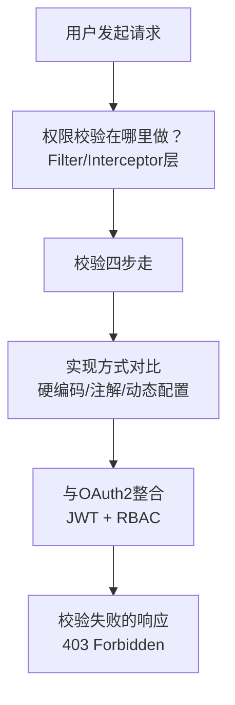
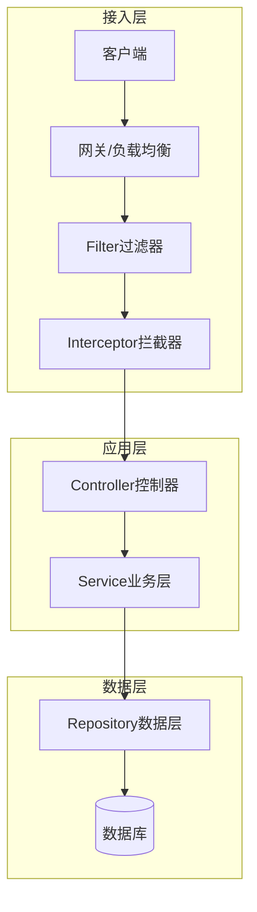
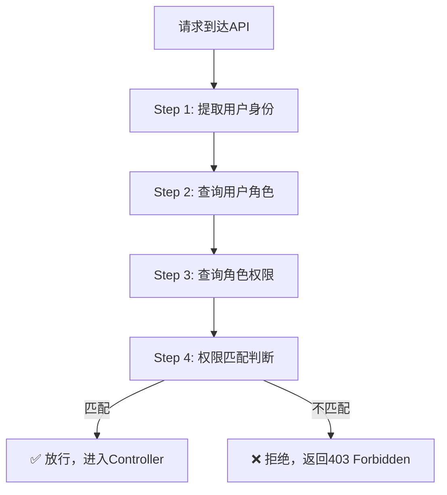
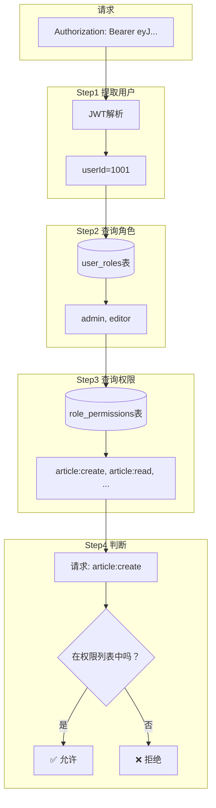
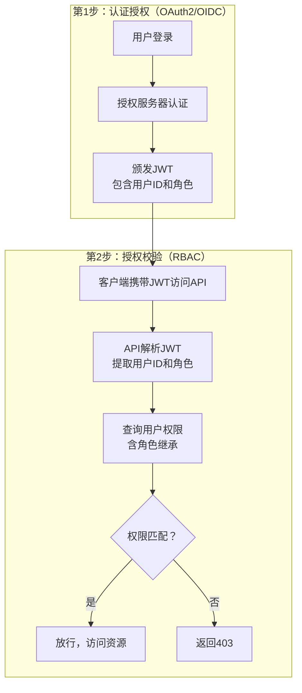
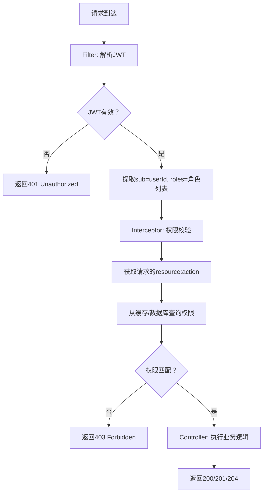
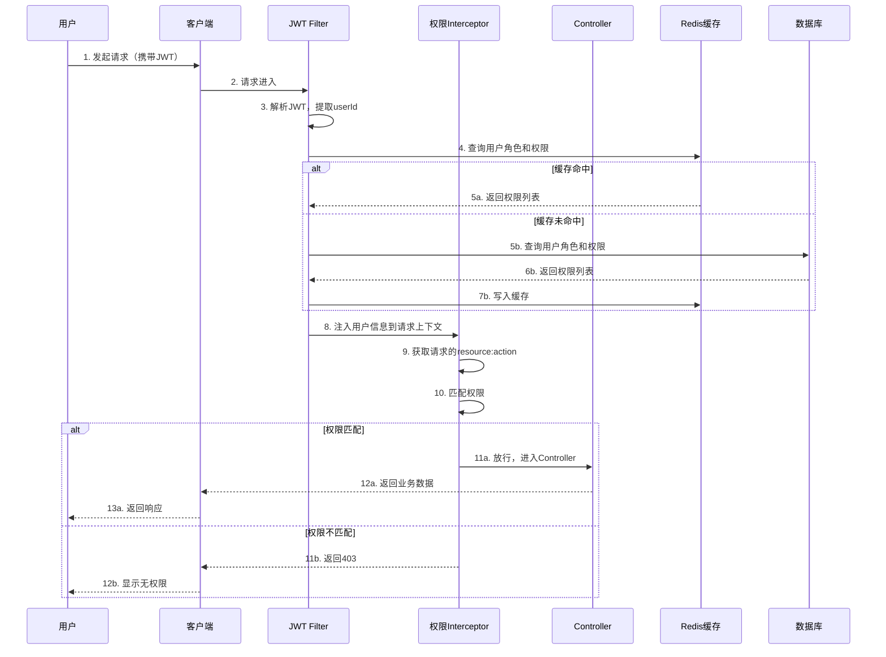

## 课程目标

- 理解权限校验在API请求处理流程中的位置和时机
- 掌握权限校验的标准四步流程
- 了解三种权限校验实现方式及其优劣
- 掌握权限校验失败的标准HTTP响应
- 理解如何将OAuth2令牌与RBAC权限体系整合
- 能够画出请求从进入API到返回响应的完整校验链路图

> [!NOTE]
>
> 请注意，在学习本节课之前请先学习OAuth2相关课程内容。

## 回顾与引入：数据有了，谁来用？

在第2讲和第3讲中，我们完成了RBAC的“数据底座”：

| 讲次  | 完成内容                   | 状态         |
| ----- | -------------------------- | ------------ |
| 第2讲 | 用户、角色、权限的概念模型 | 概念层面完成 |
| 第3讲 | PostgreSQL五张表的物理设计 | 数据层面完成 |

现在数据库里有了用户、角色、权限，也有了它们之间的关联关系。

> **但问题是：谁来使用这些数据，去拦截那些“不该进来”的请求？**

这就是本讲要解决的问题——**API接口层的权限校验**。

### 一个生活类比：小区门禁系统

想象一个高档小区的门禁系统：

| 门禁系统的组成部分             | 对应的API权限校验                       |
| ------------------------------ | --------------------------------------- |
| 小区大门（所有访客都必须经过） | **API网关/Filter**（所有请求都经过）    |
| 保安检查来客身份               | **提取用户身份**（从JWT中解析用户信息） |
| 保安查看“访客登记簿”           | **查询用户角色和权限**（查数据库）      |
| 判断是否允许进入               | **权限匹配判断**（资源+操作是否匹配）   |
| 放行或拦下                     | **允许访问或返回403**                   |

> [!NOTE]
> **权限校验“守门员”的职责：在请求进入业务逻辑之前，检查“这个人有没有权限做这件事”。** 有权限就放行，没权限就拦住——就像小区门口的保安一样。

### 本讲的知识地图



## 权限校验的时机：在哪里做？

### 请求处理的完整链条

一个HTTP请求从进入系统到返回响应，经过的完整路径如下：



### 权限校验的最佳位置

> [!IMPORTANT]
>
> 权限校验应该在‘进入Controller方法体之前’完成——即在Filter层或AOP拦截层。不能将校验逻辑**写成硬编码的形式散落在Controller方法体内**，这样会导致代码重复、易遗漏、难维护。正确的方式是使用注解声明权限需求，由框架统一在方法执行前拦截处理。

| 层次              | 职责                           | 适合做权限校验吗？            |
| ----------------- | ------------------------------ | ----------------------------- |
| 网关层            | 路由转发、限流、黑白名单       | ❌ 不涉及业务，不做细粒度权限 |
| **Filter层**      | 请求预处理（编码、认证、日志） | ✅ **最佳位置**               |
| **Interceptor层** | 请求前后处理（权限、审计）     | ✅ **最佳位置**               |
| Controller层      | 接收参数、调用Service          | ⚠️ 可以做，但已经不推荐       |
| Service层         | 业务逻辑                       | ❌ 太晚，已经浪费了计算资源   |
| Repository层      | 数据访问                       | ❌ 太晚，完全不应该           |

### 为什么不能放在Controller里？

有些开发者习惯在Controller的方法里做权限判断：

```java
// ❌ 不推荐：在Controller中做权限校验
@PostMapping("/articles")
public ResponseEntity<?> createArticle(@RequestBody Article article) {
    // 权限校验写在Controller里
    User currentUser = getCurrentUser();
    if (!currentUser.hasPermission("article:create")) {
        return ResponseEntity.status(403).build();
    }
    // 业务逻辑...
    return ResponseEntity.ok(articleService.create(article));
}
```

**这样做有什么问题？**

| 问题             | 说明                                             |
| ---------------- | ------------------------------------------------ |
| **容易遗漏**     | 开发者可能忘记在某个Controller方法中加上权限判断 |
| **代码重复**     | 每个需要权限的方法都要写类似的判断代码           |
| **难以统一管理** | 权限规则散落在几十上百个Controller中             |
| **违反单一职责** | Controller既要处理HTTP，又要做权限判断           |

> [!TIP]
> **最佳实践：权限校验应该“集中管理、统一执行”** ——放在Filter或Interceptor中，所有请求都经过，不会遗漏，也无需重复。

### 为什么不能放在Service里？

Service层虽然也可以做权限校验，但存在以下问题：

| 问题           | 说明                                              |
| -------------- | ------------------------------------------------- |
| **资源浪费**   | 请求已经经过了路由、参数绑定，才在Service中被拒绝 |
| **调用链复杂** | Service可能被多个Controller复用，权限逻辑分散     |
| **事务问题**   | 权限校验失败却已经开启了数据库事务                |

> [!NOTE]
> **权限校验的原则：越早越好，越统一越好。** 在请求进入业务逻辑之前就拦住，既高效又安全。

## 权限校验的完整流程（四步走）

### 流程图



### Step 1：提取用户身份

**目标**：从请求中识别出“是谁在操作”。

**常见方式**：

| 方式        | 说明                                             | 来源        |
| ----------- | ------------------------------------------------ | ----------- |
| **JWT解析** | 从`Authorization: Bearer <token>`中提取并解析JWT | OAuth2/OIDC |
| **Session** | 从HttpSession中获取登录用户信息                  | 传统Web应用 |
| **API Key** | 从请求头或参数中获取API Key，查表得到用户        | 服务间调用  |

**伪代码**：

```java
// 从请求中提取用户身份
String token = request.getHeader("Authorization").replace("Bearer ", "");
User user = jwtUtil.parseToken(token);
Long userId = user.getId();
```

> [!NOTE]
> 这里的“提取用户身份”和OAuth2中的“认证（Authentication）”是同一回事。在Outh2中学过的JWT中的`sub`字段，就是用户ID的来源。

### Step 2：查询用户角色

**目标**：查出该用户拥有哪些角色（含角色继承）。

**SQL查询**：

```sql
-- 查询用户的所有角色（包含继承链）
WITH RECURSIVE role_hierarchy AS (
    -- 直接分配的角色
    SELECT r.id, r.name, r.parent_role_id
    FROM roles r
    JOIN user_roles ur ON ur.role_id = r.id
    WHERE ur.user_id = ?

    UNION ALL

    -- 继承的父角色
    SELECT r.id, r.name, r.parent_role_id
    FROM roles r
    JOIN role_hierarchy rh ON rh.parent_role_id = r.id
)
SELECT id, name FROM role_hierarchy;
```

**返回示例**：

| id  | name   |
| --- | ------ |
| 3   | admin  |
| 2   | editor |
| 1   | viewer |

> [!TIP]
> 在实际系统中，用户的角色信息通常会被**缓存**（如Redis），避免每次都执行复杂的递归查询。

### Step 3：查询角色权限

**目标**：查出用户所有角色对应的所有权限（去重）。

**SQL查询**：

```sql
-- 查询角色对应的所有权限
SELECT DISTINCT p.resource, p.action
FROM permissions p
JOIN role_permissions rp ON rp.permission_id = p.id
WHERE rp.role_id IN (角色ID列表);
```

**返回示例**：

| resource | action |
| -------- | ------ |
| article  | create |
| article  | read   |
| article  | update |
| article  | delete |
| user     | read   |

### Step 4：权限匹配判断

**目标**：判断当前请求的“资源+操作”是否在用户的权限列表中。

```java
// 权限匹配判断
String requiredPermission = resource + ":" + action;  // 如 "article:create"
boolean hasPermission = userPermissions.contains(requiredPermission);

if (hasPermission) {
    // ✅ 放行，继续执行
} else {
    // ❌ 拒绝，返回403
}
```

### 完整校验流程的数据流



## 三种权限校验实现方式

### 方式一：硬编码（最简单，最不推荐）

**特点**：权限判断直接写在业务代码中。

```java
// ❌ 硬编码方式
public void deleteArticle(Long articleId) {
    User user = getCurrentUser();
    if (!"admin".equals(user.getRole())) {
        throw new ForbiddenException("只有管理员可以删除文章");
    }
    articleRepository.delete(articleId);
}
```

| 对比     | 评价                 |
| -------- | -------------------- |
| 实现难度 | ⭐ 最简单            |
| 可维护性 | 🔴 极差              |
| 适用场景 | 极小型项目、快速原型 |
| 推荐程度 | ❌ **不推荐**        |

**为什么不推荐？**

- 权限规则散落在各处，改一处权限要改多处代码
- 容易遗漏——开发者可能忘记加判断
- 无法动态调整——改权限要改代码、重新编译、重新部署

### 方式二：注解（最主流，强烈推荐）

**特点**：通过在Controller方法上添加注解来声明需要的权限。

```java
// ✅ 注解方式
@PostMapping("/articles")
@PreAuthorize("hasPermission('article:create')")
public ResponseEntity<?> createArticle(@RequestBody Article article) {
    return ResponseEntity.ok(articleService.create(article));
}

@DeleteMapping("/articles/{id}")
@PreAuthorize("hasPermission('article:delete')")
public ResponseEntity<?> deleteArticle(@PathVariable Long id) {
    articleService.delete(id);
    return ResponseEntity.noContent().build();
}
```

> [!NOTE]
>
> **注解方式的校验逻辑在哪里执行？**
>
> 虽然`@PreAuthorize`注解写在Controller方法上，但它的校验逻辑并**不是在Controller方法体内执行的**。Spring Security通过AOP代理在方法调用前创建了一个拦截点——当请求到达时，框架会先检查`@PreAuthorize`注解中的权限表达式，校验通过后才进入Controller方法体。
>
> **因此，注解方式本质上属于“在进入Controller方法体之前”拦截，与前面讨论的“权限校验时机”完全一致。** 它既满足了“统一拦截”的要求，又比Filter/Interceptor方式更加灵活和声明式。

```mermaid
flowchart TD
    subgraph 执行时机
        A[进入Controller方法体之前<br/>执行权限校验]
        B[进入Controller方法体之后<br/>执行权限校验]
    end

    A --> A1[注解方式<br/>@PreAuthorize ✅ 推荐]
    A --> A2[Filter/Interceptor方式<br/>手动编码]

    B --> B1[硬编码方式<br/>Controller方法体内 ❌ 不推荐]
    B --> B2[硬编码方式<br/>Service方法体内 ❌ 不推荐]
```

**注解的优势**：

| 优势         | 说明                               |
| ------------ | ---------------------------------- |
| **声明式**   | 权限需求一目了然，写在接口上       |
| **可读性强** | 看一眼注解就知道需要什么权限       |
| **集中拦截** | 拦截器统一处理注解，不会遗漏       |
| **灵活**     | 支持复杂的权限表达式（AND/OR组合） |

| 对比     | 评价                 |
| -------- | -------------------- |
| 实现难度 | ⭐⭐⭐ 中等          |
| 可维护性 | 🟢 好                |
| 适用场景 | **大多数企业级应用** |
| 推荐程度 | ✅ **强烈推荐**      |

### 方式三：动态配置（最灵活，最复杂）

**特点**：权限规则存储在数据库中，运行时动态加载。

```java
// 动态配置方式
@Configuration
public class SecurityConfig {

    @Autowired
    private PermissionService permissionService;

    @Bean
    public AccessDecisionManager accessDecisionManager() {
        // 从数据库动态加载权限规则
        List<PermissionRule> rules = permissionService.loadAllRules();
        return new DynamicAccessDecisionManager(rules);
    }
}
```

**适用场景**：

| 场景                       | 说明                     |
| -------------------------- | ------------------------ |
| 需要频繁调整权限规则的系统 | 如电商平台的促销活动权限 |
| 多租户系统                 | 不同租户的权限规则不同   |
| 面向最终用户的自定义权限   | 允许用户自定义角色和权限 |

| 对比     | 评价                     |
| -------- | ------------------------ |
| 实现难度 | ⭐⭐⭐⭐⭐ 最高          |
| 可维护性 | 🟡 复杂                  |
| 适用场景 | 复杂多租户系统、SaaS平台 |
| 推荐程度 | ⚠️ 按需使用              |

### 三种方式对比总结

| 对比维度       | 硬编码      | 注解        | 动态配置   |
| -------------- | ----------- | ----------- | ---------- |
| 权限规则在哪？ | 代码中      | 注解中      | 数据库中   |
| 修改权限需要？ | 改代码+部署 | 改代码+部署 | 运行时修改 |
| 灵活性         | 🔴 低       | 🟡 中       | 🟢 高      |
| 可读性         | 🔴 差       | 🟢 好       | 🟡 中      |
| 实现难度       | 🟢 低       | 🟡 中       | 🔴 高      |
| 遗漏风险       | 🔴 高       | 🟢 低       | 🟢 低      |
| 推荐程度       | ❌ 不推荐   | ✅ 推荐     | ⚠️ 按需    |

## API接口设计规范

### 资源的URL设计

RESTful API的设计核心是**资源（Resource）** ——使用名词而不是动词来表示资源。

| ❌ 不规范的URL        | ✅ 规范的URL             | 说明                   |
| --------------------- | ------------------------ | ---------------------- |
| `/getArticles`        | `GET /api/articles`      | 使用HTTP方法表示操作   |
| `/createArticle`      | `POST /api/articles`     | 资源是复数名词         |
| `/deleteArticle?id=1` | `DELETE /api/articles/1` | 使用路径参数表示资源ID |
| `/updateArticle`      | `PUT /api/articles/1`    | 使用HTTP方法表示操作   |

### API与权限的映射

每个API接口都应该对应一个明确的权限标识：

| API                     | 方法   | 权限标识         | 说明         |
| ----------------------- | ------ | ---------------- | ------------ |
| `/api/articles`         | GET    | `article:read`   | 查看文章列表 |
| `/api/articles`         | POST   | `article:create` | 创建文章     |
| `/api/articles/{id}`    | GET    | `article:read`   | 查看单篇文章 |
| `/api/articles/{id}`    | PUT    | `article:update` | 更新文章     |
| `/api/articles/{id}`    | DELETE | `article:delete` | 删除文章     |
| `/api/admin/users`      | GET    | `user:read`      | 查看用户列表 |
| `/api/admin/users/{id}` | DELETE | `user:delete`    | 删除用户     |
| `/api/orders/export`    | POST   | `order:export`   | 导出订单数据 |

### 权限与HTTP方法的对照表

| HTTP方法 | 对应的操作 | 权限动作 |
| -------- | ---------- | -------- |
| GET      | 获取资源   | `read`   |
| POST     | 创建资源   | `create` |
| PUT      | 完整更新   | `update` |
| PATCH    | 部分更新   | `update` |
| DELETE   | 删除资源   | `delete` |

## 权限校验失败的响应

### HTTP状态码：403 Forbidden

当用户认证成功但没有权限执行操作时，应返回 **403 Forbidden**。

> [!IMPORTANT]
> **401 vs 403 的区别**：
>
> - **401 Unauthorized**：用户未认证（未登录或token无效） → “我不知道你是谁”
> - **403 Forbidden**：用户已认证但无权限 → “我知道你是谁，但你没权限做这件事”

### 响应体格式

```json
{
  "code": 403,
  "status": "FORBIDDEN",
  "message": "无权限执行该操作：article:delete",
  "path": "/api/articles/123",
  "timestamp": "2024-01-15T14:30:00Z"
}
```

| 字段        | 说明                   |
| ----------- | ---------------------- |
| `code`      | HTTP状态码             |
| `status`    | 状态文字描述           |
| `message`   | 用户友好的错误信息     |
| `path`      | 请求路径，方便定位问题 |
| `timestamp` | 错误发生时间，审计用   |

### 安全注意事项

> [!WARNING]
> **不要返回过于详细的错误信息！**

| ❌ 不安全的响应                                                                   | ✅ 安全的响应                                  |
| --------------------------------------------------------------------------------- | ---------------------------------------------- |
| `{"error": "用户1001没有article:delete权限，该权限需要角色admin或senior_editor"}` | `{"code": 403, "message": "无权限执行该操作"}` |

**原因**：过详细的错误信息可能暴露系统的权限结构，给攻击者提供信息，辅助他们进行权限提升攻击。

## 与OAuth2令牌的整合

### OAuth2 + RBAC 的完整架构



### JWT中应该包含什么？

| 方式                    | 说明                                            | 优点               | 缺点                          |
| ----------------------- | ----------------------------------------------- | ------------------ | ----------------------------- |
| **方式A：只存用户ID**   | JWT中只存`sub: user_id`，每次请求查数据库       | 角色变更实时生效   | 每次请求都要查数据库          |
| **方式B：存入角色列表** | JWT中存`sub: user_id`和`roles: [admin, editor]` | 减少数据库查询     | 角色变更需重新登录才能生效    |
| **方式C：存入完整权限** | JWT中存`sub`、`roles`、`permissions`            | 无需查数据库，最快 | JWT体积大，角色变更需重新登录 |

> [!TIP]
> **推荐方式B**：在JWT中存储用户ID和角色列表（`sub` + `roles`），权限在服务端通过角色查询或缓存获取。这样既保证了性能，又保留了角色变更的灵活性。

### 整合后的完整校验流程



### 时序图：完整的请求链路



## 实践环节：画出完整的请求链路图

本实践的目是让大家将前面学到的知识串联起来，画出从“用户登录”到“API返回结果”的完整链路。

### 任务

画出以下场景的完整请求链路图：

**场景**：用户张三（角色：`editor`）登录系统，然后发起`POST /api/articles`请求创建一篇文章。

**要求**：

1. 包含以下阶段：
   - OAuth2认证阶段（获取JWT）
   - 携带JWT访问API
   - JWT Filter解析Token
   - 权限校验Interceptor检查权限
   - Controller执行业务逻辑
   - 返回结果

2. 标注每个阶段涉及的组件和数据结构

3. 标注每个阶段的数据流转

### 参考模板

```
用户张三登录系统
    ↓
【OAuth2认证阶段】
    张三输入用户名密码 → 授权服务器认证 → 返回JWT（含sub=1001, roles=[editor]）
    ↓
【API请求阶段】
    张三发起 POST /api/articles
    请求头: Authorization: Bearer <JWT>
    ↓
【JWT Filter阶段】
    解析JWT → 提取 userId=1001, roles=[editor] → 存入SecurityContext
    ↓
【权限Interceptor阶段】
    获取请求: POST /api/articles → 映射为权限: article:create
    查询用户权限: 从缓存/数据库查 editor角色的权限列表
    匹配判断: article:create 是否在列表中？
    ↓
    是 → 放行
    ↓
【Controller阶段】
    ArticleController.createArticle() 执行业务逻辑
    ↓
【返回阶段】
    返回 200 OK + 创建的文章数据
```

## 本讲小结

本节课我们学习了：

1. **权限校验的时机**：
   - 最佳位置：Filter或Interceptor层（Controller之前）
   - 为什么不能放在Controller或Service里？

2. **权限校验的四步流程**：
   - Step 1：提取用户身份（从JWT/Session中获取）
   - Step 2：查询用户角色（含角色继承）
   - Step 3：查询角色权限（去重）
   - Step 4：权限匹配判断（resource:action是否在列表中）

3. **三种实现方式**：
   - 硬编码：❌ 不推荐
   - 注解：✅ 强烈推荐
   - 动态配置：⚠️ 按需使用

4. **与OAuth2的整合**：
   - JWT中存储用户ID和角色列表
   - 服务端查询或缓存权限
   - 完整链路：认证 → 解析 → 校验 → 执行业务
